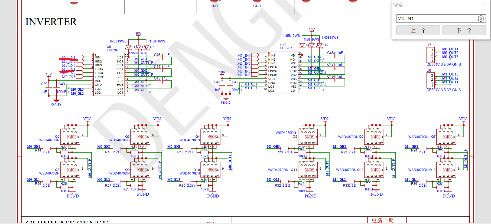
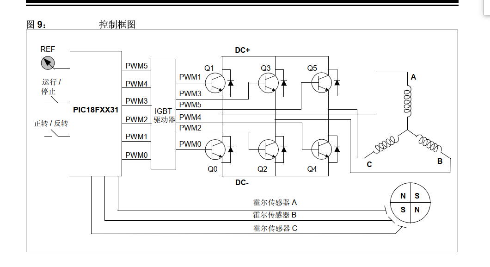

FD6287T **不是 FOC 主控芯片**，它本质上是一个 **三相半桥 MOSFET 栅极驱动芯片**。
也就是说：**FOC 算法在 MCU 里跑，FD6287T 只负责把 MCU 输出的 PWM 信号放大后去驱动 6 个 MOS 管。**

---

## 1. FD6287T 在 FOC 里处于什么位置？

一个典型三相无刷电机 FOC 系统大概是这样：

```text
电流采样 / 位置采样
        ↓
MCU：Clarke / Park / PID / SVPWM
        ↓
6 路 PWM 信号
        ↓
FD6287T 三相栅极驱动器
        ↓
6 个 MOSFET 三相逆变桥
        ↓
U / V / W 三相电机
```

所以 FD6287T 的作用是：

```text
MCU 3.3V PWM 小信号
        ↓
FD6287T
        ↓
10V~15V 左右的大电流栅极驱动信号
        ↓
推动 MOSFET 快速导通/关断
```

它自己**不做 FOC 运算**，不采电流，不读编码器，也没有 Clarke/Park/SVPWM 这些算法。

---

## 2. 这个芯片的核心参数

根据峰岹 FD6287T 数据手册，它是 **三相 250V 栅极驱动器**，内部集成了三个独立半桥驱动，封装是 **TSSOP-20**，应用场景就是三相电机驱动。它支持 3.3V/5V 逻辑输入，驱动电源 VCC 工作范围是 7V~20V，输出驱动电流大约是 +1.5A / -1.8A，并且内置 VCC/VBS 欠压保护、直通防止、输入滤波和固定死区时间。

几个重点参数可以记住：

| 参数                 | 含义                          |
| ------------------ | --------------------------- |
| 三相半桥驱动             | 可以驱动 3 个上桥 MOS + 3 个下桥 MOS  |
| 最大悬浮电压 250V        | 可用于较高母线电压的三相逆变              |
| VCC = 7V~20V       | 栅极驱动电源，一般用 12V 或 15V        |
| 逻辑输入兼容 3.3V/5V     | STM32、ESP32 等 MCU 可以直接控制输入脚 |
| 输出电流 +1.5A / -1.8A | 能比较快地给 MOS 栅极充放电            |
| 内置 200ns 死区        | 防止上下桥臂直通                    |
| 内置 UVLO            | VCC 或自举电压太低时保护 MOSFET       |

---

## 3. 管脚怎么理解？

它有 6 个 PWM 输入：

```text
HIN1 / HIN2 / HIN3    三个上桥输入
LIN1* / LIN2* / LIN3* 三个下桥输入
```

输出侧是：

```text
HO1 / HO2 / HO3  → 上桥 MOSFET 栅极
LO1 / LO2 / LO3  → 下桥 MOSFET 栅极
VS1 / VS2 / VS3  → 三相桥臂中点，也就是 U/V/W 相节点
VB1 / VB2 / VB3  → 上桥自举电源
VCC              → 驱动电源
COM              → 功率地 / 驱动地
```

数据手册的管脚说明里，1、2、3 脚是 HIN1~HIN3，4、5、6 脚是 LIN1*~LIN3*，7 脚 VCC，8 脚 COM，9~11 脚是 LO3/LO2/LO1，12/15/18 是 VS3/VS2/VS1，13/16/19 是 HO3/HO2/HO1，14/17/20 是 VB3/VB2/VB1。

这里有个很重要的坑：**LIN 后面带星号 `*`，表示它是反相逻辑。** 数据手册也说明高端输出与输入同相，低端输出与输入反相。

也就是：

```text
HINx = 1  → HOx 输出高，打开上桥 MOS

LINx* = 0 → LOx 输出高，打开下桥 MOS
LINx* = 1 → LOx 输出低，关闭下桥 MOS
```

所以你用 STM32 高级定时器输出互补 PWM 的时候，**低桥 PWM 的极性要注意**，不能无脑把 TIMx_CHxN 直接接 LINx*。要看 MCU 输出的是不是 active high，如果是普通高有效互补 PWM，可能需要配置低桥极性反相。

---

## 4. 它怎么驱动上桥 MOS？

FD6287T 这种芯片驱动上桥 MOS 需要 **自举电路**：

```text
VCC ── 自举二极管 Dbs ── VBx
                       |
                      Cbs
                       |
                      VSx
```

数据手册典型应用里也给了这个结构：VCC 通过自举二极管给 VBx-VSx 之间的自举电容充电，然后 HOx 用这个浮动电源驱动上桥 MOS。手册还建议 VCC 滤波电容靠近芯片，Cbs 自举电容用陶瓷或钽电容，Dbs 选高反压、恢复时间短的肖特基二极管。

这个地方你要记住一句话：

> **FD6287T 的上桥驱动靠自举电容供电，所以上桥不能长期 100% 常开。**

如果某一相上桥长时间一直开，下桥一直不开，自举电容没机会充电，VB-VS 电压会掉，最后触发 VBS 欠压保护，上桥关断。

FOC/SVPWM 正常 PWM 切换时一般没问题，但如果你做特殊控制，比如长时间满占空比、刹车、堵转、某相强拉高，就要考虑自举电容刷新问题。

---

## 5. 用它做 FOC 需要哪些外围？

FD6287T 只负责驱动 MOSFET，所以完整 FOC 还需要这些东西：

```text
1. MCU
   比如 STM32F103/F407/G431、ESP32、GD32 等

2. 三相 MOSFET 桥
   6 个 N-MOS

3. 电流采样
   单电阻 / 双电阻 / 三电阻采样
   还需要运放或电流采样放大器

4. 母线电压采样
   电阻分压进 ADC

5. 位置反馈
   Hall / 编码器 / 磁编码器 / 无感估算

6. 保护电路
   过流、过压、欠压、过温、短路保护

7. 栅极外围
   栅极电阻、下拉电阻、自举二极管、自举电容、VCC 去耦电容
```

所以它比较像 IR2136、IRS233x、DRV83xx 里面“栅极驱动”那一层，但它**没有集成 MOSFET**，也**没有集成电流采样放大器**，更**没有集成 FOC 算法**。

---

## 6. 和 FOC 的关系：MCU 要输出什么？

如果你用 STM32 做 FOC，一般是：

```text
TIM1_CH1   → HIN1
TIM1_CH1N  → LIN1*
TIM1_CH2   → HIN2
TIM1_CH2N  → LIN2*
TIM1_CH3   → HIN3
TIM1_CH3N  → LIN3*
```

但注意，**LINx* 是反相输入**，所以 TIM1_CHxN 的输出极性要根据实际波形配置。

FOC 里 MCU 做的事情是：

```text
ADC 采样 Ia/Ib/Ic
        ↓
Clarke 变换
        ↓
Park 变换
        ↓
Id/Iq 电流环 PI
        ↓
反 Park
        ↓
SVPWM
        ↓
三相占空比 Ta/Tb/Tc
        ↓
TIM1 输出 6 路互补 PWM
        ↓
FD6287T 驱动 MOS
```

FD6287T 只看 PWM，不知道你跑的是 FOC、六步换向、SPWM 还是 SVPWM。

---

## 7. 新手最容易踩的坑

**第一，低桥输入是反相的。**
`LIN*` 不是普通 LIN，高低侧输入逻辑不能想当然。

**第二，虽然芯片内置 200ns 死区，但 MCU 里最好也配置死区。**
数据手册说芯片内置固定死区时间，在死区期间高侧和低侧输出都为低；如果外部逻辑设置的死区时间大于内部死区，以外部死区为准；如果外部死区小于内部死区，则以内部死区为准。
实际做板子时，建议 STM32 TIM1/TIM8 里也设置 300ns~1us 左右死区，具体看 MOSFET、母线电压、开关速度、栅极电阻和波形测试结果。

**第三，自举电容和二极管布局要靠近芯片。**
VBx、VSx、HOx 这一圈是高速大 dv/dt 节点，走线太长容易乱跳、误触发、发热甚至炸管。

**第四，COM 地和功率地要小心。**
FD6287T 的 COM 是驱动参考地，最好靠近下桥 MOS 源极公共点，VCC 去耦电容也要贴近 VCC-COM。

**第五，它没有过流保护输入。**
FD6287T 数据手册主要提到 UVLO、直通防止、死区、输入滤波这些功能。真正的相电流过流保护，你还得自己用采样电阻 + 比较器/运放 + MCU BKIN 或硬件关断来做。

---

## 8. 一句话总结

FD6287T 可以这样理解：

> **MCU 负责“算 FOC”，FD6287T 负责“放大 PWM 去推 MOSFET”。**

它适合用在三相无刷电机驱动板里，比如：

```text
STM32 / GD32 / ESP32
        +
FD6287T
        +
6 个 N-MOS
        +
电流采样
        =
FOC 电机驱动器
```

你要是准备用 STM32 做开环 FOC 或 SVPWM，FD6287T 可以用，但你重点要先搞清楚三件事：**LIN* 反相逻辑、自举高桥驱动、MOSFET 三相桥保护电路**。

-----
-----
----
>
>
你的理解基本对：**三相桥确实有 6 个 MOS 管，所以驱动器芯片有 6 个输入脚**。
但是你这个原理图里，把每一相的 **高桥输入 HINx** 和 **低桥输入 LINx#** 接到了同一个 MCU PWM 信号上，所以看起来会有两个 `M0_IN1`。

重点是：**这不是画错了，而是一种 3PWM 控制方式。**

---

## 1. 你的图里不是 6 路独立 PWM，而是 3 路 PWM

看 U9 这个 FD6287：

```text
M0_IN1 → HIN1
M0_IN1 → LIN1#

M0_IN2 → HIN2
M0_IN2 → LIN2#

M0_IN3 → HIN3
M0_IN3 → LIN3#
```

也就是说，U9 虽然有 6 个输入脚：

```text
HIN1、HIN2、HIN3
LIN1#、LIN2#、LIN3#
```

但实际 MCU 只给了 3 根控制线：

```text
M0_IN1
M0_IN2
M0_IN3
```

同理 U10 是另一个电机：

```text
M1_IN1
M1_IN2
M1_IN3
```

所以你的原理图是：

```text
一个电机：3 路 PWM 输入
两个电机：6 路 PWM 输入
```

不是一个电机 6 路独立输入。

---

## 2. 为啥 HIN1 和 LIN1# 可以接同一个 IN1？

因为 `LIN1#` 后面带了一个 `#`，它是 **低有效输入**，也就是反相逻辑。

简单理解：

```text
HIN1 = 1  → 高桥 MOS 打开
HIN1 = 0  → 高桥 MOS 关闭

LIN1# = 0 → 低桥 MOS 打开
LIN1# = 1 → 低桥 MOS 关闭
```

所以如果把 `HIN1` 和 `LIN1#` 接到同一个 `M0_IN1`，效果就是：

| M0_IN1 | 上桥 MOS | 下桥 MOS | 相输出    |
| ------ | ------ | ------ | ------ |
| 1      | 开      | 关      | 接 VIN  |
| 0      | 关      | 开      | 接 PGND |

也就是 **一个 PWM 信号就能控制一相半桥的上下 MOS 互补工作**。

这就是你图里两个 `M0_IN1` 的原因。

---

## 3. 以 M0_IN1 这一相为例

你图里大概是这样：

```text
M0_IN1
   ├── HIN1
   └── LIN1#

FD6287 输出：
   HO1 → M0_GH1 → 上桥 MOS 栅极
   LO1 → M0_GL1 → 下桥 MOS 栅极

半桥输出：
   M0_OUT1_P / M0_OUT1 → 电机一相
```

所以 `M0_IN1` 不是直接驱动 MOS，而是先进入 FD6287，然后 FD6287 再输出：

```text
M0_GH1：控制上管
M0_GL1：控制下管
```

也就是说：

```text
MCU 只输出 M0_IN1
FD6287 自动帮你生成上管和下管的互补驱动
```

---

## 4. 你第二张图是 6PWM 模式

你第二张图里 PIC18FXX31 输出：

```text
PWM0
PWM1
PWM2
PWM3
PWM4
PWM5
```

这是 **6 路 PWM 控制方式**。

它是这样：

```text
PWM1 → A 相上管
PWM0 → A 相下管

PWM3 → B 相上管
PWM2 → B 相下管

PWM5 → C 相上管
PWM4 → C 相下管
```

这种方式下，MCU 对 6 个 MOS 管有更强的独立控制能力。

而你的第一张图是：

```text
M0_IN1 → A 相上下管互补
M0_IN2 → B 相上下管互补
M0_IN3 → C 相上下管互补
```

这就是 **3PWM 模式**。

---

## 5. 两种方式对比

### 你的原理图：3PWM 模式

```text
MCU 输出：
M0_IN1
M0_IN2
M0_IN3

FD6287 内部处理互补逻辑和死区
```

优点：

```text
MCU 引脚少
PWM 配置简单
适合基础 BLDC / FOC / SVPWM
```

缺点：

```text
上下管不能完全独立控制
死区主要依赖 FD6287 内部固定死区
不能灵活让某一相高阻
高级保护和高级控制能力弱一些
```

---

### 第二张图：6PWM 模式

```text
MCU 输出：
UH、UL
VH、VL
WH、WL
```

优点：

```text
控制最灵活
可以 MCU 自己设置死区
可以单独关某个上管/下管
适合更复杂的 FOC、电流采样、保护控制
```

缺点：

```text
MCU 占用 6 个 PWM 引脚
定时器配置更复杂
如果死区没配好，容易上下管直通炸 MOS
```

---

## 6. 所以你这个图能不能做 FOC？

**可以。**

FOC/SVPWM 本质上最后算出来的是三相占空比：

```text
Ta
Tb
Tc
```

对应到你的原理图就是：

```text
Ta → M0_IN1
Tb → M0_IN2
Tc → M0_IN3
```

然后 FD6287 根据这三个 PWM 信号，自动驱动 6 个 MOS 管。

所以 FOC 不一定非要 MCU 输出 6 路 PWM。
常见有两种：

```text
3PWM FOC：MCU 输出 3 路 PWM，驱动器内部生成互补
6PWM FOC：MCU 输出 6 路 PWM，MCU 自己控制上下管和死区
```

你的板子明显是 **3PWM FOC 硬件结构**。

---

## 7. 但是这里有几个注意点

### 第一，FD6287 内部死区够不够要确认

你这个图里每个 MOS 栅极串了 `2.2Ω`，下拉是 `10kΩ`。

```text
M0_GH1 → 2.2Ω → 上管 Gate
M0_GL1 → 2.2Ω → 下管 Gate
```

2.2Ω 比较小，MOS 管开关会比较快。
如果死区太短，上下管可能在切换瞬间同时导通，也就是 **直通**。

所以第一次上电测试时，建议：

```text
先低电压供电
先不接电机或接小负载
用示波器看 GH/GL 波形
确认上下管不会重叠导通
```

---

### 第二，3PWM 模式不能随便让某一相悬空

因为 `M0_IN1` 不是高就是低：

```text
M0_IN1 = 1 → 上管开
M0_IN1 = 0 → 下管开
```

正常情况下，这一相总是会被拉到 VIN 或 PGND。

如果你做六步换向，有时候希望某一相悬空，用来检测反电动势，那这种接法就不太灵活。

但是做正常 SVPWM/FOC，一般可以用。

---

### 第三，LIN# 是反相输入，这个一定要记住

你不能按普通驱动器那种理解：

```text
HIN = 1 上管开
LIN = 1 下管开
```

在你的芯片这里应该是：

```text
HIN = 1  上管开
LIN# = 0 下管开
```

所以同一个 `M0_IN1` 接到 HIN1 和 LIN1#，才会自动互补。

如果以后你改成 6PWM 输入，千万要注意低桥极性。

---

## 8. 结论

你看到两个 `M0_IN1`，不是因为输入端重复画错了，而是因为：

```text
M0_IN1 同时接 HIN1 和 LIN1#
```

利用 `LIN1#` 的反相特性，实现：

```text
M0_IN1 = 1 → 上管开，下管关
M0_IN1 = 0 → 上管关，下管开
```

所以你的板子是：

```text
FD6287T + 6 MOSFET
但是 MCU 对每个电机只需要 3 路 PWM
```

也就是 **3PWM 三相逆变驱动结构**。
做 FOC 时，MCU 输出三相 SVPWM 占空比到 `M0_IN1 / M0_IN2 / M0_IN3` 就行。


