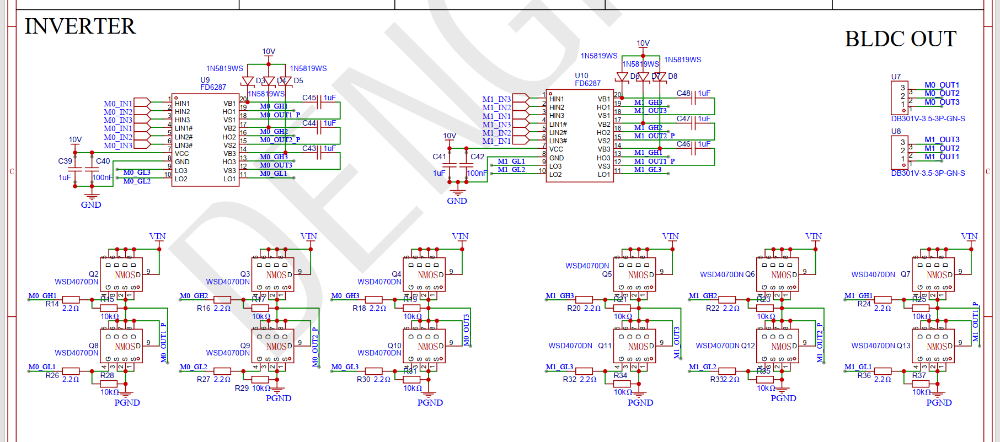

对，你这个函数**应该在一个固定周期的 FOC 控制循环里调用**。

不要放在普通 `while(1)` 里面随便跑，因为 `dt_s` 必须稳定，否则角度累加就不稳定，三相 SPWM 波形会抖。

---

## 1. 这个函数应该在哪里调用？

整体关系应该是这样：

```c
定时器周期到
    ↓
foc_update_open_loop_angle(target_rpm, dt_s);   // 更新 theta_e
    ↓
根据 theta_e 计算三相 SPWM 占空比
    ↓
更新 MCPWM 三相 PWM 比较值
```

也就是：

```c
void foc_control_step(float dt_s)
{
    foc_update_open_loop_angle(g_target_rpm, dt_s);

    foc_spwm_update(
        vik_diy_foc_data.motor_parm_val.theta_e,
        g_uq_voltage
    );
}
```

你这个 `foc_update_open_loop_angle()` 只负责生成电角度 `theta_e`，后面还得用这个 `theta_e` 去算三相 PWM：

```c
Ua = sinf(theta_e);
Ub = sinf(theta_e - 2π / 3);
Uc = sinf(theta_e + 2π / 3);
```

---

## 2. ESP32 上要不要用硬件定时器？

**建议用。**

ESP-IDF 里有几种方式：

| 方式                        |    适合程度 | 说明                              |
| ------------------------- | ------: | ------------------------------- |
| `while(1) + vTaskDelay()` |     不推荐 | 抖动大，不适合电机控制                     |
| `esp_timer`               | 能跑 Demo | 是高精度软件定时器，但官方也说实时要求高时推荐 GPTimer |
| `GPTimer`                 |   推荐入门用 | 硬件通用定时器，周期稳定                    |
| `MCPWM timer on_empty`    |     更专业 | 和 PWM 周期同步，适合后面做真正 FOC          |

ESP-IDF 官方文档也提到，`esp_timer` 适合周期动作，但对实时性更高、需要更可配置定时精度的场景，推荐用 `GPTimer`；而 MCPWM 本身就是用来产生电机控制 PWM，文档里也明确提到可生成用于 FOC 的 SVPWM 信号。([Espressif Systems][1])

---

## 3. 推荐你现在这样做

你现在是新手手写开环 FOC，我建议先这样：

```text
MCPWM：负责输出三相 PWM
GPTimer：每 100us 或 1ms 触发一次 FOC 控制循环
```

比如：

| 控制频率   |     dt_s | 适合情况                |
| ------ | -------: | ------------------- |
| 1 kHz  |   0.001f | 最容易调试，低速开环 Demo     |
| 5 kHz  |  0.0002f | 比较平滑                |
| 10 kHz |  0.0001f | 更接近正式电机控制           |
| 20 kHz | 0.00005f | 和常见 PWM 频率同步，计算压力更大 |

你可以先用：

```c
#define FOC_CTRL_FREQ_HZ      10000
#define FOC_CTRL_PERIOD_US    100
#define FOC_CTRL_DT_S         0.0001f
```

也就是 **10kHz 控制频率**。

---

## 4. 控制循环应该长这样

```c
static float g_target_rpm = 300.0f;
static float g_uq_voltage = 2.0f;

void foc_control_step(float dt_s)
{
    // 1. 根据目标 RPM 更新开环电角度
    foc_update_open_loop_angle(g_target_rpm, dt_s);

    // 2. 根据 theta_e 计算三相 SPWM 并更新 MCPWM
    foc_spwm_update(
        vik_diy_foc_data.motor_parm_val.theta_e,
        g_uq_voltage
    );
}
```

其中 `foc_spwm_update()` 里面大概是：

```c
void foc_spwm_update(float theta_e, float uq)
{
    float ua;
    float ub;
    float uc;

    ua = uq * sinf(theta_e);
    ub = uq * sinf(theta_e - FOC_2PI / 3.0f);
    uc = uq * sinf(theta_e + FOC_2PI / 3.0f);

    // 把 -Uq ~ +Uq 映射成 0.0 ~ 1.0 占空比
    float duty_a = 0.5f + ua / (2.0f * vik_diy_foc_data.motor_parm_val.vbus);
    float duty_b = 0.5f + ub / (2.0f * vik_diy_foc_data.motor_parm_val.vbus);
    float duty_c = 0.5f + uc / (2.0f * vik_diy_foc_data.motor_parm_val.vbus);

    foc_set_pwm_duty(duty_a, duty_b, duty_c);
}
```

这里的关系是：

```text
theta_e 决定三相波形转到哪里
uq 决定输出电压幅值
duty_a / duty_b / duty_c 决定三相 PWM 占空比
```

---

## 5. GPTimer 调用方式

ESP-IDF v5.x 推荐用新的 `driver/gptimer.h`，旧的 `driver/timer.h` 已经属于旧 Timer Group 驱动。官方迁移文档也说 Timer Group 驱动已经重构为 GPTimer。([Espressif Systems][2])

### 头文件

```c
#include "driver/gptimer.h"
#include "freertos/FreeRTOS.h"
#include "freertos/task.h"
```

### 全局变量

```c
#define FOC_CTRL_FREQ_HZ      10000
#define FOC_CTRL_PERIOD_US    (1000000 / FOC_CTRL_FREQ_HZ)
#define FOC_CTRL_DT_S         (1.0f / FOC_CTRL_FREQ_HZ)

static TaskHandle_t s_foc_task_handle = NULL;
static gptimer_handle_t s_foc_timer = NULL;
```

---

## 6. 定时器中断里不要直接做复杂计算

不建议在中断里直接 `sinf()`、`cosf()`、大量浮点计算、打印日志。

推荐做法：

```text
GPTimer 中断
    ↓
通知高优先级任务
    ↓
任务里执行 foc_control_step()
```

ESP-IDF 文档里也说明，定时器或者 MCPWM 的回调是在 ISR 上下文里运行时，不能阻塞，只能使用 `FromISR` 这类 FreeRTOS API；MCPWM 的 timer callback 也是 ISR 上下文。([Espressif Systems][3])

---

## 7. GPTimer 回调函数

```c
static bool IRAM_ATTR foc_timer_alarm_cb(gptimer_handle_t timer,
                                         const gptimer_alarm_event_data_t *edata,
                                         void *user_ctx)
{
    BaseType_t high_task_woken = pdFALSE;

    if (s_foc_task_handle != NULL)
    {
        vTaskNotifyGiveFromISR(s_foc_task_handle, &high_task_woken);
    }

    return high_task_woken == pdTRUE;
}
```

这个中断里只做一件事：

```text
通知 FOC 任务：该跑一次控制循环了
```

---

## 8. FOC 控制任务

```c
static void foc_task(void *arg)
{
    while (1)
    {
        // 等待 GPTimer 中断通知
        ulTaskNotifyTake(pdTRUE, portMAX_DELAY);

        // 每次被唤醒，执行一次 FOC 控制
        foc_control_step(FOC_CTRL_DT_S);
    }
}
```

---

## 9. 初始化 GPTimer

```c
void foc_gptimer_init(void)
{
    // 1. 创建 FOC 控制任务
    xTaskCreatePinnedToCore(
        foc_task,
        "foc_task",
        4096,
        NULL,
        20,
        &s_foc_task_handle,
        1
    );

    // 2. 创建 GPTimer
    gptimer_config_t timer_config = {
        .clk_src = GPTIMER_CLK_SRC_DEFAULT,
        .direction = GPTIMER_COUNT_UP,
        .resolution_hz = 1000000,   // 1MHz，1 tick = 1us
    };

    ESP_ERROR_CHECK(gptimer_new_timer(&timer_config, &s_foc_timer));

    // 3. 配置周期中断
    gptimer_alarm_config_t alarm_config = {
        .reload_count = 0,
        .alarm_count = FOC_CTRL_PERIOD_US,
        .flags.auto_reload_on_alarm = true,
    };

    ESP_ERROR_CHECK(gptimer_set_alarm_action(s_foc_timer, &alarm_config));

    // 4. 注册中断回调
    gptimer_event_callbacks_t cbs = {
        .on_alarm = foc_timer_alarm_cb,
    };

    ESP_ERROR_CHECK(gptimer_register_event_callbacks(s_foc_timer, &cbs, NULL));

    // 5. 使能并启动定时器
    ESP_ERROR_CHECK(gptimer_enable(s_foc_timer));
    ESP_ERROR_CHECK(gptimer_start(s_foc_timer));
}
```

然后你在 `app_main()` 里：

```c
void app_main(void)
{
    // 1. 初始化电机参数
    vik_diy_foc_data.motor_parm_val.pole_pairs = 7;
    vik_diy_foc_data.motor_parm_val.vbus = 12.0f;
    vik_diy_foc_data.motor_parm_val.theta_e = 0.0f;

    // 2. 初始化 MCPWM 三相 PWM
    foc_mcpwm_init();

    // 3. 启动 FOC 定时控制循环
    foc_gptimer_init();
}
```

---

## 10. 更推荐的最终结构

你的工程可以分成这样：

```text
app_main()
    ↓
foc_mcpwm_init()
    ↓
foc_gptimer_init()
    ↓
FOC 控制任务周期运行
        ↓
        foc_update_open_loop_angle()
        ↓
        foc_spwm_update()
        ↓
        foc_set_pwm_duty()
```

文件可以这样分：

```text
main/
├── main.c
├── foc_math.c          // Clarke/Park/SPWM/SVPWM 数学
├── foc_open_loop.c     // 开环角度更新
├── foc_mcpwm.c         // ESP32 MCPWM 输出
├── foc_control.c       // FOC 控制循环
└── foc_control.h
```

---

## 11. 后面更专业的做法：用 MCPWM timer 事件同步

等你后面熟了，可以不用单独 GPTimer，而是直接用 MCPWM timer 的 `on_empty` 或 `on_full` 事件。

MCPWM 文档里有 `mcpwm_timer_register_event_callbacks()`，其中 `on_empty` 表示计数到 0 时触发，`on_full` 表示计数到峰值时触发。([Espressif Systems][4])

这样结构更专业：

```text
MCPWM PWM 周期开始
    ↓
on_empty 事件
    ↓
更新下一周期的 duty
```

好处是：

```text
FOC 控制周期和 PWM 周期严格同步
```

而且 MCPWM comparator 支持设置比较值更新时机，比如在 timer 计数到 0、计数到峰值或同步信号时更新，避免 PWM 占空比在周期中间乱跳。([Espressif Systems][5])

---

## 12. 你现在先别搞太复杂

你现在学习阶段，建议先按这个顺序来：

```text
第一步：MCPWM 输出固定 50% 占空比，确认三相 PWM 有波形
第二步：GPTimer 1kHz 调用 foc_control_step()
第三步：把 target_rpm 设置成 60 RPM，看三相 SPWM 慢慢滚动
第四步：把控制频率提高到 5kHz / 10kHz
第五步：加 target_rpm 斜坡，不要直接跳变
第六步：再考虑 MCPWM on_empty 同步
```

你的这个函数最终应该就是这样调用：

```c
void foc_control_step(float dt_s)
{
    foc_update_open_loop_angle(g_target_rpm, dt_s);

    foc_spwm_update(
        vik_diy_foc_data.motor_parm_val.theta_e,
        g_uq_voltage
    );
}
```

然后 `foc_control_step()` 由 GPTimer 周期触发。这个就是 ESP32 上开环速度 SPWM/FOC 的基本运行框架。

[1]: https://docs.espressif.com/projects/esp-idf/en/stable/esp32/api-reference/system/esp_timer.html "ESP Timer (High Resolution Timer) - ESP32 -  — ESP-IDF Programming Guide v6.0.1 documentation"
[2]: https://docs.espressif.com/projects/esp-idf/en/stable/esp32c2/migration-guides/release-5.x/5.0/peripherals.html?utm_source=chatgpt.com "Peripherals - ESP32-C2 - — ESP-IDF Programming Guide ..."
[3]: https://docs.espressif.com/projects/esp-idf/en/v5.0.5/esp32s2/api-reference/peripherals/gptimer.html?utm_source=chatgpt.com "General Purpose Timer (GPTimer) - ESP32-S2 - — ESP-IDF ..."
[4]: https://docs.espressif.com/projects/esp-idf/en/stable/esp32/api-reference/peripherals/mcpwm.html "Motor Control Pulse Width Modulator (MCPWM) - ESP32 -  — ESP-IDF Programming Guide v6.0.1 documentation"
[5]: https://docs.espressif.com/projects/esp-idf/en/v5.0/esp32/api-reference/peripherals/mcpwm.html "Motor Control Pulse Width Modulator (MCPWM) - ESP32 -  — ESP-IDF Programming Guide v5.0 documentation"


------
-----
-----
你这版已经可以叫 **“开环电压 FOC + SPWM 雏形”** 了。核心链路已经搭起来了：

```text
target_rpm
  ↓
更新 theta_e
  ↓
Ud/Uq
  ↓
逆 Park
  ↓
Ualpha/Ubeta
  ↓
逆 Clarke
  ↓
Ua/Ub/Uc
  ↓
SPWM duty
```

你上传的 `.c` 里 `vfoc_init()`、`set_theta_e()`、`park_inv_transform()`、`clark_inv_transform()`、`vfoc_spwm_calc_duty()` 和 `vfoc_open_loop_spwm_run()` 这几块已经基本串起来了。

---

# 1. 最大方向：对，要用 ESP32 的定时器

你这个不能用普通 `while(1)` 乱跑，最好用**固定周期**执行：

```c
vfoc_open_loop_spwm_run(target_rpm, uq, vbus, dt_s);
```

因为你里面这句：

```c
vfoc_dt.motor_par.theta_e += omega_e * dt_s;
```

依赖 `dt_s` 准确。

如果 `dt_s` 不稳定，电角度增长就不稳定，电机就容易：

```text
抖动
啸叫
转速不稳
启动失败
```

ESP32 上推荐：

```text
MCPWM 负责产生三相 PWM 波形
GPTimer 或 MCPWM timer event 负责周期性更新 FOC
```

Espressif 官方文档里，MCPWM 本身就是用于电机控制的 PWM 外设，里面有 timer、operator、comparator、generator、dead-time、fault 等模块；文档也明确提到 MCPWM 可用于 FOC 里的 SVPWM 信号生成。([Espressif Systems][1])

---

# 2. 推荐执行架构

建议你先这样做：

```text
PWM 载波频率：20kHz
FOC 更新频率：1kHz ~ 10kHz
```

初学低速测试可以：

```text
MCPWM 频率：20kHz
FOC 计算周期：1ms，也就是 1kHz
```

后面速度上去之后，FOC 更新频率要提高到：

```text
5kHz 或 10kHz
```

因为你的 2208 电机极对数是 7，假设机械速度 1800 rpm：

```text
机械频率 = 1800 / 60 = 30 转/秒
电频率 = 30 × 7 = 210 Hz
```

如果 FOC 只用 1kHz 更新，那么一个电周期只有：

```text
1000 / 210 ≈ 4.76 个点
```

太少了，波形会很粗糙。低速学习可以，真要跑高转速不够。

---

# 3. 你的代码目前主要问题

## 问题 1：`set_theta_e()` 名字不准确

你现在这个函数：

```c
void set_theta_e(float target_rpm, float dt_s)
```

它不是“设置电角度”，而是：

```text
根据目标转速积分更新电角度
```

建议改名：

```c
void vfoc_update_open_loop_angle(float target_rpm, float dt_s);
```

这样更准确。

---

## 问题 2：`theta_m` 没有更新

你现在只更新了：

```c
vfoc_dt.motor_par.theta_e += omega_e * dt_s;
```

但没有更新：

```c
vfoc_dt.motor_par.theta_m
```

如果你暂时不用 `theta_m`，问题不大。

但是结构体里既然有机械角度，建议一起维护：

```c
vfoc_dt.motor_par.theta_m += omega_m * dt_s;
```

然后也限制到 `0 ~ 2π`。

---

## 问题 3：必须保证先调用 `vfoc_init()`

如果你没有先调用：

```c
vfoc_init();
```

那么：

```c
vfoc_dt.motor_par.pole_pairs
```

默认是 0。

这样这里：

```c
omega_e = omega_m * vfoc_dt.motor_par.pole_pairs;
```

就会变成：

```c
omega_e = 0
```

电角度不动，电机也不会转。

所以主函数里必须先：

```c
vfoc_init();
```

---

## 问题 4：`dt_s` 需要检查

你现在没有检查：

```c
dt_s <= 0
```

建议加：

```c
if (dt_s <= 0.0f)
{
    return;
}
```

否则传错参数时，角度更新会异常。

---

## 问题 5：`target_rpm` 和 `uq` 需要限幅

现在你传多少它就用多少。

建议先限制一下：

```c
target_rpm = vfoc_limit(target_rpm, -300.0f, 300.0f);
uq = vfoc_limit(uq, 0.0f, vbus * 0.3f);
```

初学阶段别一上来跑 1800 rpm。

建议从：

```c
target_rpm = 30.0f;
uq = 0.5f;
```

开始。

然后慢慢加：

```text
30 rpm → 60 rpm → 100 rpm
0.5V → 1V → 2V
```

---

## 问题 6：`spwm_duty_val` 放在 `motor_driver_parm_t` 里不太清晰

你现在是：

```c
typedef struct
{
    float Ua;
    float Ub;
    float Uc;
    spwm_duty_t spwm_duty_val;
} motor_driver_parm_t;
```

这样也能用。

但逻辑上更清晰的是：

```c
typedef struct 
{
    clark_parm_t clark_val;
    park_parm_t park_val;
    motor_driver_parm_t motor_drv_val;
    spwm_duty_t spwm_duty_val;
    motor_parm_t motor_par;
} foc_data_t;
```

也就是：

```text
motor_drv_val 只保存 Ua/Ub/Uc
spwm_duty_val 单独保存 duty
```

这样层次更清楚。

---

## 问题 7：外部文件拿不到 `vfoc_dt`

你的 `.c` 里定义了：

```c
foc_data_t vfoc_dt = {0};
```

但是 `.h` 里没有：

```c
extern foc_data_t vfoc_dt;
```

所以别的文件想拿 duty 时不方便。

你有两个选择。

### 方案 A：头文件声明 extern

```c
extern foc_data_t vfoc_dt;
```

然后 main 里可以访问：

```c
vfoc_dt.motor_drv_val.spwm_duty_val.duty_Ua
```

### 方案 B：更推荐，加 getter 函数

```c
spwm_duty_t vfoc_get_spwm_duty(void)
{
    return vfoc_dt.motor_drv_val.spwm_duty_val;
}
```

头文件加：

```c
spwm_duty_t vfoc_get_spwm_duty(void);
```

这样模块封装更好。

---

# 4. 你现在的 SPWM 公式基本对

你现在写的是：

```c
duty.duty_Ua = 0.5f + motor_v->Ua / vbus;
duty.duty_Ub = 0.5f + motor_v->Ub / vbus;
duty.duty_Uc = 0.5f + motor_v->Uc / vbus;
```

这个是中心偏置 SPWM 的思路。

但是注意：为了不削顶，`Uq` 不能太大。

因为：

```text
duty = 0.5 ± Uphase / vbus
```

所以大概要求：

```text
|Uphase| <= vbus / 2
```

12V 母线时，初学建议：

```text
Uq = 0.5V ~ 2V
```

不要一上来给：

```text
Uq = 6.5V
```

否则占空比容易到边界，电流也可能很大。

---

# 5. `vfoc_limit()` 注释有个小错误

你写：

```c
@param min 0 (表示占空比100%)
@param max 1 (表示占空比100%)
```

这里 `min 0` 应该是：

```text
0 表示占空比 0%
1 表示占空比 100%
```

改成：

```c
@param min 0.0f 表示占空比 0%
@param max 1.0f 表示占空比 100%
```

---

# 6. ESP32 上怎么执行比较好？

推荐结构：

```text
app_main()
  ↓
vfoc_init()
  ↓
mcpwm_init_3phase()
  ↓
gptimer_init_1khz_or_10khz()
  ↓
定时器周期到
  ↓
vfoc_open_loop_spwm_run()
  ↓
把 duty 写入 MCPWM comparator
```

ESP-IDF 的 GPTimer 是硬件通用定时器驱动，可以产生周期性 alarm，用来完成周期任务；官方文档也说明 GPTimer 适合高分辨率、周期 alarm 这种场景。([Espressif Systems][2])

不建议优先用普通 FreeRTOS 软件定时器做 FOC，因为实时性差一些。

`esp_timer` 也能做周期回调，但官方文档说明，默认 callback 是在高优先级 esp_timer task 里串行执行，其他高优先级任务或者 SPI Flash 操作可能造成回调延迟；需要更好实时性时，官方建议用 GPTimer。([Espressif Systems][3])

---

# 7. 初学推荐执行周期

先不要一上来搞太高。

可以这样：

```c
#define VFOC_CTRL_FREQ_HZ   1000
#define VFOC_DT_S           (1.0f / VFOC_CTRL_FREQ_HZ)
```

然后每 1ms 执行一次：

```c
vfoc_open_loop_spwm_run(30.0f, 0.8f, 12.0f, 0.001f);
```

后面再改成：

```c
#define VFOC_CTRL_FREQ_HZ   5000
#define VFOC_DT_S           (1.0f / VFOC_CTRL_FREQ_HZ)
```

或者：

```c
#define VFOC_CTRL_FREQ_HZ   10000
#define VFOC_DT_S           (1.0f / VFOC_CTRL_FREQ_HZ)
```

---

# 8. 推荐你这样改 `vfoc_open_loop_spwm_run()`

```c
void vfoc_open_loop_spwm_run(float target_rpm, float uq, float vbus, float dt_s)
{
    clark_parm_t l_temp_clark_v = {0};

    if ((vbus <= 0.0f) || (dt_s <= 0.0f))
    {
        return;
    }

    target_rpm = vfoc_limit(target_rpm, -300.0f, 300.0f);
    uq = vfoc_limit(uq, 0.0f, vbus * 0.3f);

    vfoc_update_open_loop_angle(target_rpm, dt_s);

    vfoc_dt.park_val.Uq = uq;
    vfoc_dt.park_val.Ud = 0.0f;

    l_temp_clark_v = park_inv_transform(&vfoc_dt);

    vfoc_dt.motor_drv_val = clark_inv_transform(&l_temp_clark_v);

    vfoc_dt.motor_drv_val.spwm_duty_val =
        vfoc_spwm_calc_duty(&vfoc_dt.motor_drv_val, vbus);
}
```

同时把：

```c
set_theta_e()
```

改名成：

```c
vfoc_update_open_loop_angle()
```

---

# 9. 推荐你这样写定时器执行逻辑

先用“定时器回调置标志 + 高优先级任务执行 FOC”的方式，比较安全。

不要在定时器中断里 `printf`。
也先不要在中断里做太多复杂逻辑。

伪代码：

```c
static volatile bool g_foc_update_flag = false;

static bool foc_timer_callback(...)
{
    g_foc_update_flag = true;
    return false;
}

void foc_task(void *arg)
{
    while (1)
    {
        if (g_foc_update_flag)
        {
            g_foc_update_flag = false;

            vfoc_open_loop_spwm_run(30.0f, 0.8f, MOTOR_DRV_VBUS, 0.001f);

            spwm_duty_t duty = vfoc_get_spwm_duty();

            /*
             * 把 duty 写入 MCPWM
             * duty_Ua -> A相 PWM compare
             * duty_Ub -> B相 PWM compare
             * duty_Uc -> C相 PWM compare
             */
        }

        vTaskDelay(1);
    }
}
```

不过更专业的方式是用信号量/任务通知，不是一直轮询 flag。

例如：

```c
vTaskNotifyGiveFromISR(foc_task_handle, &high_task_wakeup);
```

然后任务里：

```c
ulTaskNotifyTake(pdTRUE, portMAX_DELAY);
```

---

# 10. 真正上 MCPWM 时，更新的是比较值

假设 PWM 频率 20kHz，MCPWM timer 分辨率 1MHz：

```text
period_ticks = 1000000 / 20000 = 50
```

如果：

```c
duty = 0.6f;
```

那么：

```c
compare_ticks = duty * period_ticks = 30
```

所以你最后要做的是：

```c
compare_a = duty_Ua * period_ticks;
compare_b = duty_Ub * period_ticks;
compare_c = duty_Uc * period_ticks;
```

然后写到 MCPWM comparator 里。

---

# 11. 开环启动建议

开环不能直接：

```c
target_rpm = 1000;
uq = 3.0f;
```

容易抖、不转、啸叫。

建议启动流程：

```text
1. vfoc_init()
2. 给一个固定角度，低电压保持 300ms，做转子预定位
3. target_rpm 从 0 缓慢爬升到 30 rpm
4. Uq 从 0.5V 慢慢加到 1V
5. 观察电机是否跟随旋转
```

比如：

```text
0 rpm, 0.5V, 300ms
10 rpm, 0.6V
20 rpm, 0.7V
30 rpm, 0.8V
```

如果方向反了，有三种改法：

```text
1. target_rpm 改成负数
2. Uq 改成负数
3. 任意交换电机两相线
```

软件上最方便的是：

```c
target_rpm = -target_rpm;
```

---

# 12. 你现在还缺的东西

| 模块         | 当前情况           |
| ---------- | -------------- |
| 逆 Park     | 有了，基本对         |
| 逆 Clarke   | 有了，基本对         |
| 电角度积分      | 有了，建议改名和补参数检查  |
| SPWM duty  | 有了，基本对         |
| FOC 初始化    | 有了，必须先调用       |
| duty 对外获取  | 还缺             |
| MCPWM 三相输出 | 还缺             |
| 定时器周期调用    | 还缺             |
| 启动斜坡       | 还缺             |
| 过流/过压/欠压保护 | 还缺             |
| 死区互补输出     | 取决于你的驱动硬件，通常需要 |
| 电流采样闭环     | 后续再做           |

---

# 13. 你下一步应该做什么

你现在代码下一步不要继续纠结公式了，公式主干已经能用了。

下一步按这个顺序做：

```text
1. 改名 set_theta_e → vfoc_update_open_loop_angle
2. 增加 vfoc_get_spwm_duty()
3. ESP32 初始化 MCPWM 三相 PWM，频率先 20kHz
4. 用 GPTimer 每 1ms 调一次 FOC
5. 把 duty_Ua/U扔到 MCPWM comparator
6. 先 target_rpm=30, uq=0.5~1.0 测试
```

一句话：**FOC 算法部分你已经能进入上板测试阶段了，现在关键是用 MCPWM 输出三相 PWM，再用 GPTimer 或 MCPWM 事件保证固定周期更新。**

[1]: https://docs.espressif.com/projects/esp-idf/en/stable/esp32/api-reference/peripherals/mcpwm.html "Motor Control Pulse Width Modulator (MCPWM) - ESP32 -  — ESP-IDF Programming Guide v6.0.1 documentation"
[2]: https://docs.espressif.com/projects/esp-idf/en/stable/esp32/api-reference/peripherals/gptimer.html "General Purpose Timer (GPTimer) - ESP32 -  — ESP-IDF Programming Guide v6.0.1 documentation"
[3]: https://docs.espressif.com/projects/esp-idf/en/stable/esp32/api-reference/system/esp_timer.html "ESP Timer (High Resolution Timer) - ESP32 -  — ESP-IDF Programming Guide v6.0.1 documentation"

----
----
----
可以。你现在算法部分已经基本能接 ESP32 外设了。你的代码里已经有：

```text
vfoc_init()
set_theta_e()
park_inv_transform()
clark_inv_transform()
vfoc_spwm_calc_duty()
vfoc_open_loop_spwm_run()
```

也就是已经能算出 `duty_Ua / duty_Ub / duty_Uc`，下一步就是：**用 ESP32 的 MCPWM 输出三相 PWM，再用 GPTimer 固定周期调用你的 FOC 运算函数**。你现在的 `vfoc_open_loop_spwm_run()` 已经把“更新电角度 → 逆 Park → 逆 Clarke → SPWM duty”串起来了。

下面我按 **ESP-IDF v5.x / v5.5.x 风格** 给你一个具体落地教程。

---

# 1. 总体架构

你要这样分工：

```text
MCPWM：
    负责输出三相 PWM：Ua / Ub / Uc

GPTimer：
    每 1ms 或 0.2ms 触发一次控制周期

FOC task：
    调用 vfoc_open_loop_spwm_run()
    读取 duty_Ua / duty_Ub / duty_Uc
    更新 MCPWM comparator
```

MCPWM 官方就是用来做电机控制 PWM 的，里面有 timer、operator、comparator、generator、dead-time、fault 等模块；其中 comparator 用来产生比较事件，generator 根据 timer/comparator 事件改变 PWM 输出电平。([Espressif Systems][1])

---

# 2. 你先确认硬件输入方式：3PWM 还是 6PWM

这一步很关键。

## 情况 A：你的驱动芯片只需要 3 个 PWM 输入

比如：

```text
U_PWM
V_PWM
W_PWM
```

那你 ESP32 只需要输出：

```text
GPIO_U
GPIO_V
GPIO_W
```

这种最简单。你现在的 `duty_Ua / duty_Ub / duty_Uc` 就正好对应这三个 PWM。

---

## 情况 B：你的驱动芯片需要 6 个输入

比如：

```text
UH / UL
VH / VL
WH / WL
```

那就要输出互补 PWM，还要加死区：

```text
U_H 与 U_L 互补
V_H 与 V_L 互补
W_H 与 W_L 互补
```

MCPWM 有 dead-time 子模块，官方文档说明它可以给 PWM 边沿插入延迟，避免上下桥臂直通。([Espressif Systems][1])

**你现在新手阶段建议先按 3PWM 跑通。**
等三相波形和开环转动确认后，再升级 6PWM + 死区。

---

# 3. 推荐参数

先用这组：

```c
#define VFOC_PWM_FREQ_HZ       20000      // PWM 载波 20kHz
#define VFOC_PWM_RES_HZ        10000000   // MCPWM 分辨率 10MHz
#define VFOC_PWM_PERIOD_TICKS  (VFOC_PWM_RES_HZ / VFOC_PWM_FREQ_HZ)

#define VFOC_CTRL_FREQ_HZ      1000       // FOC 控制频率 1kHz
#define VFOC_DT_S              (1.0f / VFOC_CTRL_FREQ_HZ)
```

计算一下：

```text
PWM period_ticks = 10MHz / 20kHz = 500 ticks
```

所以：

```text
duty = 0.5
compare = 250
```

这样精度比 `1MHz / 20kHz = 50 ticks` 好很多。

---

# 4. 先给你的 FOC 模块加一个获取 duty 的函数

你现在 `vfoc_dt` 在 `.c` 里面是全局变量：

```c
foc_data_t vfoc_dt = {0};
```

但是别的文件不太方便拿里面的 duty。建议加一个 getter。

## vik_foc.h 增加

```c
spwm_duty_t vfoc_get_spwm_duty(void);
```

## vik_foc.c 增加

```c
spwm_duty_t vfoc_get_spwm_duty(void)
{
    return vfoc_dt.motor_drv_val.spwm_duty_val;
}
```

这样 ESP32 的 PWM 文件可以这样拿 duty：

```c
spwm_duty_t duty = vfoc_get_spwm_duty();
```

---

# 5. 建一个 ESP32 MCPWM 驱动文件

建议新建：

```text
main/vik_foc_hw.c
main/vik_foc_hw.h
```

这个文件专门负责 ESP32 硬件 PWM 和定时器。

---

# 6. `vik_foc_hw.h`

```c
#ifndef VIK_FOC_HW_H
#define VIK_FOC_HW_H

#include "esp_err.h"

esp_err_t vik_foc_mcpwm_init(void);
esp_err_t vik_foc_mcpwm_set_duty(float duty_u, float duty_v, float duty_w);

esp_err_t vik_foc_timer_start(void);

#endif
```

---

# 7. `vik_foc_hw.c`：MCPWM 三相 PWM 初始化

下面这个是 **3PWM 版本**，也就是只输出 `U/V/W` 三个 PWM。

```c
#include "vik_foc_hw.h"
#include "vik_foc.h"

#include <stdbool.h>
#include <stdint.h>

#include "esp_check.h"
#include "esp_log.h"
#include "freertos/FreeRTOS.h"
#include "freertos/task.h"

#include "driver/mcpwm_prelude.h"
#include "driver/gptimer.h"

#define TAG "VFOC_HW"

/*
 * 你自己根据板子改 GPIO。
 * 注意：不要用已经被 Flash、PSRAM、串口占用的 GPIO。
 */
#define VFOC_PWM_U_GPIO        4
#define VFOC_PWM_V_GPIO        5
#define VFOC_PWM_W_GPIO        6

#define VFOC_PWM_FREQ_HZ       20000
#define VFOC_PWM_RES_HZ        10000000
#define VFOC_PWM_PERIOD_TICKS  (VFOC_PWM_RES_HZ / VFOC_PWM_FREQ_HZ)

#define VFOC_CTRL_FREQ_HZ      1000
#define VFOC_CTRL_TIMER_RES_HZ 1000000
#define VFOC_CTRL_ALARM_COUNT  (VFOC_CTRL_TIMER_RES_HZ / VFOC_CTRL_FREQ_HZ)
#define VFOC_DT_S              (1.0f / VFOC_CTRL_FREQ_HZ)

/*
 * 开环测试参数
 */
#define VFOC_TEST_RPM          30.0f
#define VFOC_TEST_UQ           0.8f
#define VFOC_TEST_VBUS         MOTOR_DRV_VBUS

typedef struct
{
    mcpwm_timer_handle_t timer;
    mcpwm_oper_handle_t  oper[3];
    mcpwm_cmpr_handle_t  cmp[3];
    mcpwm_gen_handle_t   gen[3];
} vik_mcpwm_3pwm_t;

static vik_mcpwm_3pwm_t s_mcpwm = {0};
static gptimer_handle_t s_foc_timer = NULL;
static TaskHandle_t s_foc_task_handle = NULL;

static uint32_t duty_to_compare(float duty)
{
    if (duty > 1.0f)
    {
        duty = 1.0f;
    }

    if (duty < 0.0f)
    {
        duty = 0.0f;
    }

    return (uint32_t)(duty * VFOC_PWM_PERIOD_TICKS);
}

esp_err_t vik_foc_mcpwm_set_duty(float duty_u, float duty_v, float duty_w)
{
    ESP_RETURN_ON_FALSE(s_mcpwm.cmp[0] != NULL, ESP_ERR_INVALID_STATE, TAG, "MCPWM not init");

    uint32_t cmp_u = duty_to_compare(duty_u);
    uint32_t cmp_v = duty_to_compare(duty_v);
    uint32_t cmp_w = duty_to_compare(duty_w);

    ESP_ERROR_CHECK(mcpwm_comparator_set_compare_value(s_mcpwm.cmp[0], cmp_u));
    ESP_ERROR_CHECK(mcpwm_comparator_set_compare_value(s_mcpwm.cmp[1], cmp_v));
    ESP_ERROR_CHECK(mcpwm_comparator_set_compare_value(s_mcpwm.cmp[2], cmp_w));

    return ESP_OK;
}

esp_err_t vik_foc_mcpwm_init(void)
{
    const int pwm_gpio[3] = {
        VFOC_PWM_U_GPIO,
        VFOC_PWM_V_GPIO,
        VFOC_PWM_W_GPIO,
    };

    /*
     * 1. 创建 MCPWM timer
     */
    mcpwm_timer_config_t timer_config = {
        .group_id = 0,
        .clk_src = MCPWM_TIMER_CLK_SRC_DEFAULT,
        .resolution_hz = VFOC_PWM_RES_HZ,
        .period_ticks = VFOC_PWM_PERIOD_TICKS,
        .count_mode = MCPWM_TIMER_COUNT_MODE_UP,
    };

    ESP_ERROR_CHECK(mcpwm_new_timer(&timer_config, &s_mcpwm.timer));

    /*
     * 2. 创建 3 个 operator，分别对应 U/V/W 三相
     *    这 3 个 operator 连接到同一个 timer，这样三相 PWM 同步。
     */
    for (int i = 0; i < 3; i++)
    {
        mcpwm_operator_config_t oper_config = {
            .group_id = 0,
        };

        ESP_ERROR_CHECK(mcpwm_new_operator(&oper_config, &s_mcpwm.oper[i]));
        ESP_ERROR_CHECK(mcpwm_operator_connect_timer(s_mcpwm.oper[i], s_mcpwm.timer));
    }

    /*
     * 3. 每相创建 comparator + generator
     */
    for (int i = 0; i < 3; i++)
    {
        mcpwm_comparator_config_t cmp_config = {
            .flags.update_cmp_on_tez = true,
        };

        ESP_ERROR_CHECK(mcpwm_new_comparator(s_mcpwm.oper[i], &cmp_config, &s_mcpwm.cmp[i]));

        mcpwm_generator_config_t gen_config = {
            .gen_gpio_num = pwm_gpio[i],
        };

        ESP_ERROR_CHECK(mcpwm_new_generator(s_mcpwm.oper[i], &gen_config, &s_mcpwm.gen[i]));

        /*
         * 4. 配置 PWM 动作：
         *    timer 从 0 开始时输出 HIGH
         *    计数到 compare 值时输出 LOW
         *
         *    所以 compare 越大，占空比越大。
         */
        ESP_ERROR_CHECK(mcpwm_generator_set_action_on_timer_event(
            s_mcpwm.gen[i],
            MCPWM_GEN_TIMER_EVENT_ACTION(MCPWM_TIMER_DIRECTION_UP,
                                         MCPWM_TIMER_EVENT_EMPTY,
                                         MCPWM_GEN_ACTION_HIGH)));

        ESP_ERROR_CHECK(mcpwm_generator_set_action_on_compare_event(
            s_mcpwm.gen[i],
            MCPWM_GEN_COMPARE_EVENT_ACTION(MCPWM_TIMER_DIRECTION_UP,
                                           s_mcpwm.cmp[i],
                                           MCPWM_GEN_ACTION_LOW)));

        /*
         * 初始占空比 50%
         */
        ESP_ERROR_CHECK(mcpwm_comparator_set_compare_value(
            s_mcpwm.cmp[i],
            VFOC_PWM_PERIOD_TICKS / 2));
    }

    /*
     * 5. 启动 MCPWM timer
     */
    ESP_ERROR_CHECK(mcpwm_timer_enable(s_mcpwm.timer));
    ESP_ERROR_CHECK(mcpwm_timer_start_stop(s_mcpwm.timer, MCPWM_TIMER_START_NO_STOP));

    ESP_LOGI(TAG, "MCPWM init done, pwm_freq=%dHz, period_ticks=%d",
             VFOC_PWM_FREQ_HZ, VFOC_PWM_PERIOD_TICKS);

    return ESP_OK;
}
```

官方文档里，timer 的 `resolution_hz` 决定 tick 分辨率，`period_ticks` 决定 PWM 周期；comparator 的比较值可以运行时更新，但要注意新值生效时机和不要超过 timer 峰值。([Espressif Systems][1])

---

# 8. 用 GPTimer 固定周期触发 FOC

GPTimer 可以配置周期 alarm，官方文档里 `alarm_count` 是触发 alarm 的计数值，`auto_reload_on_alarm` 可以让它周期性重载；同时 callback 在中断上下文执行，所以里面不要做复杂阻塞操作。([Espressif Systems][2])

建议：**GPTimer ISR 只通知任务，FOC 运算放到任务里。**

继续在 `vik_foc_hw.c` 里加：

```c
static bool foc_timer_alarm_cb(gptimer_handle_t timer,
                               const gptimer_alarm_event_data_t *edata,
                               void *user_ctx)
{
    BaseType_t high_task_wakeup = pdFALSE;

    if (s_foc_task_handle != NULL)
    {
        vTaskNotifyGiveFromISR(s_foc_task_handle, &high_task_wakeup);
    }

    return high_task_wakeup == pdTRUE;
}

static void foc_control_task(void *arg)
{
    while (1)
    {
        /*
         * 等待 GPTimer 通知。
         * 每来一次通知，执行一次 FOC 控制周期。
         */
        ulTaskNotifyTake(pdTRUE, portMAX_DELAY);

        /*
         * 1. 跑你的开环 FOC + SPWM 算法
         */
        vfoc_open_loop_spwm_run(VFOC_TEST_RPM,
                                VFOC_TEST_UQ,
                                VFOC_TEST_VBUS,
                                VFOC_DT_S);

        /*
         * 2. 获取三相 duty
         */
        spwm_duty_t duty = vfoc_get_spwm_duty();

        /*
         * 3. 写入 MCPWM comparator
         */
        vik_foc_mcpwm_set_duty(duty.duty_Ua,
                               duty.duty_Ub,
                               duty.duty_Uc);
    }
}

esp_err_t vik_foc_timer_start(void)
{
    /*
     * 1. 创建 FOC 控制任务
     */
    xTaskCreatePinnedToCore(foc_control_task,
                            "foc_task",
                            4096,
                            NULL,
                            20,
                            &s_foc_task_handle,
                            1);

    /*
     * 2. 创建 GPTimer
     *    resolution = 1MHz，1 tick = 1us
     */
    gptimer_config_t timer_config = {
        .clk_src = GPTIMER_CLK_SRC_DEFAULT,
        .direction = GPTIMER_COUNT_UP,
        .resolution_hz = VFOC_CTRL_TIMER_RES_HZ,
    };

    ESP_ERROR_CHECK(gptimer_new_timer(&timer_config, &s_foc_timer));

    /*
     * 3. 配置周期 alarm
     *    VFOC_CTRL_FREQ_HZ = 1000Hz 时：
     *    alarm_count = 1000000 / 1000 = 1000us = 1ms
     */
    gptimer_alarm_config_t alarm_config = {
        .reload_count = 0,
        .alarm_count = VFOC_CTRL_ALARM_COUNT,
        .flags.auto_reload_on_alarm = true,
    };

    ESP_ERROR_CHECK(gptimer_set_alarm_action(s_foc_timer, &alarm_config));

    /*
     * 4. 注册 alarm callback
     */
    gptimer_event_callbacks_t cbs = {
        .on_alarm = foc_timer_alarm_cb,
    };

    ESP_ERROR_CHECK(gptimer_register_event_callbacks(s_foc_timer, &cbs, NULL));

    /*
     * 5. 启动 GPTimer
     */
    ESP_ERROR_CHECK(gptimer_enable(s_foc_timer));
    ESP_ERROR_CHECK(gptimer_start(s_foc_timer));

    ESP_LOGI(TAG, "FOC timer started, ctrl_freq=%dHz", VFOC_CTRL_FREQ_HZ);

    return ESP_OK;
}
```

---

# 9. `app_main()` 里这样调用

```c
#include "esp_log.h"
#include "vik_foc.h"
#include "vik_foc_hw.h"

void app_main(void)
{
    /*
     * 1. 初始化你的 FOC 算法变量
     */
    vfoc_init();

    /*
     * 2. 初始化 MCPWM 三相 PWM
     */
    vik_foc_mcpwm_init();

    /*
     * 3. 启动 GPTimer，周期触发 FOC 控制任务
     */
    vik_foc_timer_start();
}
```

---

# 10. CMakeLists.txt 要包含这些文件

你的 `main/CMakeLists.txt` 类似这样：

```cmake
idf_component_register(
    SRCS
        "main.c"
        "vik_foc.c"
        "vik_foc_hw.c"
    INCLUDE_DIRS
        "."
)
```

---

# 11. 先别接电机，先用示波器看三相 PWM

先不要直接上电机，先看 GPIO 波形。

测试参数：

```c
#define VFOC_TEST_RPM    30.0f
#define VFOC_TEST_UQ     0.8f
```

你应该看到：

```text
U 相 PWM 占空比慢慢正弦变化
V 相 PWM 占空比慢慢正弦变化
W 相 PWM 占空比慢慢正弦变化
三相相差约 120°
```

注意：PWM 载波是 20kHz，但是占空比包络是低频正弦变化。
如果你示波器只看单点，会看到高频 PWM；如果用低通或者看 duty 趋势，才能看到 SPWM 包络。

---

# 12. 接电机前必须注意

先按这个顺序：

```text
1. 不接电机，只看三相 PWM 波形
2. 接驱动板，不接电机，看驱动输出是否正常
3. 接电机，但 Uq 很小
4. target_rpm 很低
5. 逐步加 Uq 和 rpm
```

推荐初始值：

```c
target_rpm = 10.0f;
uq = 0.5f;
```

然后慢慢试：

```text
10 rpm, 0.5V
20 rpm, 0.6V
30 rpm, 0.8V
50 rpm, 1.0V
```

不要一开始就：

```text
1800 rpm
Uq = 6.5V
```

开环时转子不一定跟得上旋转磁场，太快容易抖动、啸叫、发热。

---

# 13. 你的代码还建议改两个小点

## 第一个：`set_theta_e()` 改名

你现在的函数叫：

```c
void set_theta_e(float target_rpm, float dt_s)
```

但它实际是根据转速积分更新电角度，不是简单 set。

建议改名：

```c
void vfoc_update_open_loop_angle(float target_rpm, float dt_s)
```

你当前代码里 `set_theta_e()` 做了 RPM 到机械角速度、电角速度、角度积分和角度归一化，这就是开环速度的核心。

---

## 第二个：增加参数保护

你的 `vfoc_open_loop_spwm_run()` 里建议加：

```c
if ((vbus <= 0.0f) || (dt_s <= 0.0f))
{
    return;
}
```

再限制一下：

```c
uq = vfoc_limit(uq, 0.0f, vbus * 0.3f);
```

初学时让 `uq` 不超过母线电压的 30%，会安全很多。

---

# 14. 如果你是 6PWM 驱动，后面这样升级

如果你的驱动芯片要：

```text
UH UL
VH VL
WH WL
```

那么每相要两个 generator：

```text
gen_u_h / gen_u_l
gen_v_h / gen_v_l
gen_w_h / gen_w_l
```

先让 `gen_h` 产生主 PWM，再用 dead-time 模块派生出互补的 `gen_l`。MCPWM 文档里给了 active-high complementary 的典型配置：主路在 timer empty 拉高、compare 拉低，然后通过 dead-time 给互补路增加边沿延迟和反相。([Espressif Systems][1])

你现在先别急着写 6PWM。
先用 3PWM 确认：

```text
FOC 数学正确
三相 duty 正确
目标 rpm 能改变三相包络变化速度
```

---

# 15. 最终你现在要做的执行步骤

按这个来：

```text
第一步：给 vik_foc.c 加 vfoc_get_spwm_duty()

第二步：新建 vik_foc_hw.c / vik_foc_hw.h

第三步：用 MCPWM 初始化 3 个 PWM GPIO

第四步：用 GPTimer 1kHz 周期通知 foc_task

第五步：foc_task 里面调用：
        vfoc_open_loop_spwm_run(30.0f, 0.8f, 12.0f, 0.001f)

第六步：把 duty_Ua / duty_Ub / duty_Uc 写到 MCPWM comparator

第七步：示波器看三相 PWM

第八步：低电压、低转速接电机测试
```

一句话：**ESP32 这边必须利用 MCPWM；定时触发建议用 GPTimer。你的 FOC 函数不要随便在 while(1) 里跑，要固定周期跑，否则 `dt_s` 不准，电角度就不准，开环速度就会飘。**

[1]: https://docs.espressif.com/projects/esp-idf/en/stable/esp32/api-reference/peripherals/mcpwm.html "Motor Control Pulse Width Modulator (MCPWM) - ESP32 -  — ESP-IDF Programming Guide v6.0.1 documentation"
[2]: https://docs.espressif.com/projects/esp-idf/en/stable/esp32/api-reference/peripherals/gptimer.html "General Purpose Timer (GPTimer) - ESP32 -  — ESP-IDF Programming Guide v6.0.1 documentation"

---
---
----

>
对，你这个硬件**不是 MCU 输出 6 路互补 PWM**。你这套是：

```text
ESP32 输出 3 路 PWM：M0_IN1 / M0_IN2 / M0_IN3
        ↓
FD6287 内部生成高低桥驱动：HO1/LO1、HO2/LO2、HO3/LO3
        ↓
外部 6 个 NMOS
        ↓
M0_OUT1 / M0_OUT2 / M0_OUT3 接 BLDC 三相
```

先搞 **M0 电机**，就只管左边这个 FD6287：`U9`。从你图里看，`M0_IN1` 同时进了 `HIN1` 和 `LIN1#`，`M0_IN2` 同时进了 `HIN2` 和 `LIN2#`，`M0_IN3` 同时进了 `HIN3` 和 `LIN3#`。这说明你的硬件设计就是 **3PWM 模式**。

FD6287T 本身是三相 250V 栅极驱动器，内部集成三个半桥驱动，支持 3.3V/5V 逻辑输入，VCC 推荐工作范围 7~20V，并内置欠压保护、直通防止和约 200ns 死区；它不是功率 MOS 本体，下面的 Q2/Q3/Q4/Q8/Q9/Q10 才是功率 NMOS。([fortiortech.com][1])

---

# 1. 先把硬件对应关系搞清楚

你现在只控制 M0，所以只用这三个 MCU 信号：

```text
ESP32_GPIO_U  →  M0_IN1  →  U9 HIN1 + LIN1#  →  M0_OUT1
ESP32_GPIO_V  →  M0_IN2  →  U9 HIN2 + LIN2#  →  M0_OUT2
ESP32_GPIO_W  →  M0_IN3  →  U9 HIN3 + LIN3#  →  M0_OUT3
```

你的软件里的三相 duty 对应关系就是：

```text
duty_Ua → M0_IN1 → M0_OUT1
duty_Ub → M0_IN2 → M0_OUT2
duty_Uc → M0_IN3 → M0_OUT3
```

所以 **ESP32 不需要输出 M0_GH1/M0_GL1 这些信号**。
`M0_GH1/M0_GL1` 是 FD6287 到 MOS 管栅极的驱动信号，不是 ESP32 直接控制的。

---

# 2. 为什么 3PWM 就能驱动上下桥？

因为你图里把同一相的 `HINx` 和 `LINx#` 接到了同一个 MCU PWM。

FD6287 的特点是：

```text
高边输出 HO 和 HIN 同相
低边输出 LO 和 LIN# 反相
```

所以当 `M0_IN1 = 1`：

```text
HIN1 = 1  → HO1 打开高边 MOS
LIN1# = 1 → LO1 关闭低边 MOS
```

当 `M0_IN1 = 0`：

```text
HIN1 = 0  → HO1 关闭高边 MOS
LIN1# = 0 → LO1 打开低边 MOS
```

也就是说，**一个 PWM 信号就能让一个半桥上下管互补动作**。FD6287 内部还有直通防止和固定死区，所以你现在这个硬件方案下，ESP32 先不要自己做 6 路互补 PWM。([fortiortech.com][1])

---

# 3. ESP32 这边应该怎么做？

你的软件目标是：

```text
vfoc_open_loop_spwm_run()
        ↓
得到 duty_Ua / duty_Ub / duty_Uc
        ↓
ESP32 MCPWM 输出到 M0_IN1 / M0_IN2 / M0_IN3
```

所以 ESP32 外设配置应该是：

```text
MCPWM 3路输出：
    PWM_U → M0_IN1
    PWM_V → M0_IN2
    PWM_W → M0_IN3

GPTimer：
    固定周期 1kHz 或 5kHz 调用 FOC 算法
```

MCPWM 的新驱动就是由 timer、operator、comparator、generator 这些对象组成的；comparator 用来根据 timer 计数值产生比较事件，generator 根据 timer/comparator 事件改变 GPIO 输出电平。([Espressif Systems][2])

---

# 4. GPIO 先这样选

如果你用的是 **ESP32-WROOM-32-N8**，先用类似这种普通输出 GPIO：

```c
#define M0_IN1_GPIO    25
#define M0_IN2_GPIO    26
#define M0_IN3_GPIO    27
```

不要用：

```text
GPIO6 ~ GPIO11：通常被 Flash 占用
GPIO34 ~ GPIO39：只能输入，不能输出 PWM
```

Espressif FAQ 也说明了 WROOM-32 系列里 GPIO6~GPIO11 被内部 Flash 占用，GPIO34/35/36/39 是输入专用。([Espressif Systems][3])

如果你的 PCB 已经固定了 M0_IN1/2/3 接到 ESP32 某些 GPIO，那就以 PCB 为准，把宏改成对应 GPIO。

---

# 5. 你的 FOC 模块先加一个 getter

你现在 `vfoc_dt` 在 `vik_foc.c` 里：

```c
foc_data_t vfoc_dt={0};
```

为了让 ESP32 PWM 驱动层拿到 duty，建议在 `vik_foc.h` 加：

```c
spwm_duty_t vfoc_get_spwm_duty(void);
```

在 `vik_foc.c` 加：

```c
spwm_duty_t vfoc_get_spwm_duty(void)
{
    return vfoc_dt.motor_drv_val.spwm_duty_val;
}
```

这样硬件层不用直接访问 `vfoc_dt`。

---

# 6. 新建 `m0_fd6287_pwm.h`

```c
#ifndef M0_FD6287_PWM_H
#define M0_FD6287_PWM_H

#include "esp_err.h"

esp_err_t m0_fd6287_pwm_init(void);
esp_err_t m0_fd6287_pwm_set_duty(float duty_u, float duty_v, float duty_w);
esp_err_t m0_foc_control_start(void);

#endif
```

---

# 7. 新建 `m0_fd6287_pwm.c`

下面这份是给你这个 **FD6287 + 3PWM + M0电机** 用的。

```c
#include "m0_fd6287_pwm.h"
#include "vik_foc.h"

#include <stdbool.h>
#include <stdint.h>

#include "esp_check.h"
#include "esp_log.h"

#include "freertos/FreeRTOS.h"
#include "freertos/task.h"

#include "driver/mcpwm_prelude.h"
#include "driver/gptimer.h"

#define TAG "M0_FD6287"

/*
 * 这三个 GPIO 对应你的硬件 M0_IN1 / M0_IN2 / M0_IN3。
 * 你需要根据自己的 PCB 改。
 */
#define M0_IN1_GPIO                25
#define M0_IN2_GPIO                26
#define M0_IN3_GPIO                27

/*
 * PWM 载波频率。
 * 20kHz 基本听不到啸叫，适合先测试。
 */
#define M0_PWM_FREQ_HZ             20000

/*
 * MCPWM 计数分辨率。
 * 10MHz 表示 1 tick = 0.1us。
 *
 * 20kHz PWM 时：
 * period_ticks = 10MHz / 20kHz = 500 ticks
 */
#define M0_PWM_RES_HZ              10000000
#define M0_PWM_PERIOD_TICKS        (M0_PWM_RES_HZ / M0_PWM_FREQ_HZ)

/*
 * FOC 控制周期。
 * 新手先 1kHz，也就是 1ms 调一次 FOC。
 */
#define M0_FOC_CTRL_FREQ_HZ        1000
#define M0_FOC_DT_S                (1.0f / M0_FOC_CTRL_FREQ_HZ)

/*
 * GPTimer 分辨率 1MHz，1 tick = 1us。
 * 1kHz 控制频率时，alarm_count = 1000us。
 */
#define M0_CTRL_TIMER_RES_HZ       1000000
#define M0_CTRL_ALARM_COUNT        (M0_CTRL_TIMER_RES_HZ / M0_FOC_CTRL_FREQ_HZ)

/*
 * 开环测试参数。
 * 先低速、低电压。
 */
#define M0_TEST_RPM                30.0f
#define M0_TEST_UQ                 0.8f
#define M0_TEST_VBUS               MOTOR_DRV_VBUS

/*
 * 因为 FD6287 高边是 bootstrap 供电，初期不建议 duty 到 0% 或 100%。
 * 这里限制在 2% ~ 98%。
 */
#define M0_DUTY_MIN                0.02f
#define M0_DUTY_MAX                0.98f

typedef struct
{
    mcpwm_timer_handle_t timer;
    mcpwm_oper_handle_t oper[3];
    mcpwm_cmpr_handle_t cmp[3];
    mcpwm_gen_handle_t gen[3];
} m0_mcpwm_3pwm_t;

static m0_mcpwm_3pwm_t s_m0_pwm = {0};
static gptimer_handle_t s_m0_ctrl_timer = NULL;
static TaskHandle_t s_m0_foc_task_handle = NULL;

static float m0_limit_float(float value, float min, float max)
{
    if (value > max)
    {
        return max;
    }

    if (value < min)
    {
        return min;
    }

    return value;
}

static uint32_t m0_duty_to_compare(float duty)
{
    duty = m0_limit_float(duty, M0_DUTY_MIN, M0_DUTY_MAX);

    return (uint32_t)(duty * (float)M0_PWM_PERIOD_TICKS);
}

esp_err_t m0_fd6287_pwm_set_duty(float duty_u, float duty_v, float duty_w)
{
    if ((s_m0_pwm.cmp[0] == NULL) ||
        (s_m0_pwm.cmp[1] == NULL) ||
        (s_m0_pwm.cmp[2] == NULL))
    {
        return ESP_ERR_INVALID_STATE;
    }

    uint32_t cmp_u = m0_duty_to_compare(duty_u);
    uint32_t cmp_v = m0_duty_to_compare(duty_v);
    uint32_t cmp_w = m0_duty_to_compare(duty_w);

    ESP_ERROR_CHECK(mcpwm_comparator_set_compare_value(s_m0_pwm.cmp[0], cmp_u));
    ESP_ERROR_CHECK(mcpwm_comparator_set_compare_value(s_m0_pwm.cmp[1], cmp_v));
    ESP_ERROR_CHECK(mcpwm_comparator_set_compare_value(s_m0_pwm.cmp[2], cmp_w));

    return ESP_OK;
}

esp_err_t m0_fd6287_pwm_init(void)
{
    const int pwm_gpio[3] = {
        M0_IN1_GPIO,
        M0_IN2_GPIO,
        M0_IN3_GPIO,
    };

    /*
     * 1. 创建一个 MCPWM timer。
     * 三相共用同一个 timer，这样 U/V/W 三相同步。
     */
    mcpwm_timer_config_t timer_config = {
        .group_id = 0,
        .clk_src = MCPWM_TIMER_CLK_SRC_DEFAULT,
        .resolution_hz = M0_PWM_RES_HZ,
        .period_ticks = M0_PWM_PERIOD_TICKS,
        .count_mode = MCPWM_TIMER_COUNT_MODE_UP,
    };

    ESP_ERROR_CHECK(mcpwm_new_timer(&timer_config, &s_m0_pwm.timer));

    /*
     * 2. 创建 3 个 operator。
     * 一个 operator 对应一相 PWM。
     */
    for (int i = 0; i < 3; i++)
    {
        mcpwm_operator_config_t oper_config = {
            .group_id = 0,
        };

        ESP_ERROR_CHECK(mcpwm_new_operator(&oper_config, &s_m0_pwm.oper[i]));
        ESP_ERROR_CHECK(mcpwm_operator_connect_timer(s_m0_pwm.oper[i], s_m0_pwm.timer));
    }

    /*
     * 3. 每相创建 comparator 和 generator。
     */
    for (int i = 0; i < 3; i++)
    {
        mcpwm_comparator_config_t cmp_config = {
            .flags.update_cmp_on_tez = true,
        };

        ESP_ERROR_CHECK(mcpwm_new_comparator(s_m0_pwm.oper[i],
                                             &cmp_config,
                                             &s_m0_pwm.cmp[i]));

        mcpwm_generator_config_t gen_config = {
            .gen_gpio_num = pwm_gpio[i],
        };

        ESP_ERROR_CHECK(mcpwm_new_generator(s_m0_pwm.oper[i],
                                            &gen_config,
                                            &s_m0_pwm.gen[i]));

        /*
         * 4. 配置普通边沿 PWM：
         *
         * timer 计数到 0，也就是 EMPTY 事件：输出 HIGH
         * timer 计数到 compare：输出 LOW
         *
         * 所以 compare 越大，占空比越大。
         */
        ESP_ERROR_CHECK(mcpwm_generator_set_action_on_timer_event(
            s_m0_pwm.gen[i],
            MCPWM_GEN_TIMER_EVENT_ACTION(MCPWM_TIMER_DIRECTION_UP,
                                         MCPWM_TIMER_EVENT_EMPTY,
                                         MCPWM_GEN_ACTION_HIGH)));

        ESP_ERROR_CHECK(mcpwm_generator_set_action_on_compare_event(
            s_m0_pwm.gen[i],
            MCPWM_GEN_COMPARE_EVENT_ACTION(MCPWM_TIMER_DIRECTION_UP,
                                           s_m0_pwm.cmp[i],
                                           MCPWM_GEN_ACTION_LOW)));

        /*
         * 初始 50% 占空比。
         */
        ESP_ERROR_CHECK(mcpwm_comparator_set_compare_value(
            s_m0_pwm.cmp[i],
            M0_PWM_PERIOD_TICKS / 2));
    }

    /*
     * 5. 启动 PWM timer。
     */
    ESP_ERROR_CHECK(mcpwm_timer_enable(s_m0_pwm.timer));
    ESP_ERROR_CHECK(mcpwm_timer_start_stop(s_m0_pwm.timer,
                                           MCPWM_TIMER_START_NO_STOP));

    ESP_LOGI(TAG,
             "M0 FD6287 3PWM init done, freq=%dHz, period_ticks=%d",
             M0_PWM_FREQ_HZ,
             M0_PWM_PERIOD_TICKS);

    return ESP_OK;
}
```

---

# 8. 加 FOC 周期任务和 GPTimer

继续在 `m0_fd6287_pwm.c` 里加：

```c
static bool m0_ctrl_timer_alarm_cb(gptimer_handle_t timer,
                                   const gptimer_alarm_event_data_t *edata,
                                   void *user_ctx)
{
    BaseType_t high_task_wakeup = pdFALSE;

    if (s_m0_foc_task_handle != NULL)
    {
        vTaskNotifyGiveFromISR(s_m0_foc_task_handle, &high_task_wakeup);
    }

    return high_task_wakeup == pdTRUE;
}

static void m0_foc_control_task(void *arg)
{
    while (1)
    {
        /*
         * 等待 GPTimer 中断通知。
         */
        ulTaskNotifyTake(pdTRUE, portMAX_DELAY);

        /*
         * 1. 运行你的开环 FOC + SPWM。
         */
        vfoc_open_loop_spwm_run(M0_TEST_RPM,
                                M0_TEST_UQ,
                                M0_TEST_VBUS,
                                M0_FOC_DT_S);

        /*
         * 2. 取出三相 duty。
         */
        spwm_duty_t duty = vfoc_get_spwm_duty();

        /*
         * 3. 写入 MCPWM。
         *
         * duty_Ua → M0_IN1
         * duty_Ub → M0_IN2
         * duty_Uc → M0_IN3
         */
        m0_fd6287_pwm_set_duty(duty.duty_Ua,
                               duty.duty_Ub,
                               duty.duty_Uc);
    }
}

esp_err_t m0_foc_control_start(void)
{
    /*
     * 1. 创建 FOC 控制任务。
     * FOC 计算在 task 中做，不要在 GPTimer ISR 里做 float 运算和 PWM 更新。
     */
    xTaskCreatePinnedToCore(m0_foc_control_task,
                            "m0_foc_task",
                            4096,
                            NULL,
                            20,
                            &s_m0_foc_task_handle,
                            1);

    /*
     * 2. 创建 GPTimer。
     * 1MHz 分辨率，1 tick = 1us。
     */
    gptimer_config_t timer_config = {
        .clk_src = GPTIMER_CLK_SRC_DEFAULT,
        .direction = GPTIMER_COUNT_UP,
        .resolution_hz = M0_CTRL_TIMER_RES_HZ,
    };

    ESP_ERROR_CHECK(gptimer_new_timer(&timer_config, &s_m0_ctrl_timer));

    /*
     * 3. 设置周期 alarm。
     * 1kHz 时，alarm_count = 1000。
     */
    gptimer_alarm_config_t alarm_config = {
        .reload_count = 0,
        .alarm_count = M0_CTRL_ALARM_COUNT,
        .flags.auto_reload_on_alarm = true,
    };

    ESP_ERROR_CHECK(gptimer_set_alarm_action(s_m0_ctrl_timer, &alarm_config));

    /*
     * 4. 注册 alarm 回调。
     */
    gptimer_event_callbacks_t cbs = {
        .on_alarm = m0_ctrl_timer_alarm_cb,
    };

    ESP_ERROR_CHECK(gptimer_register_event_callbacks(s_m0_ctrl_timer, &cbs, NULL));

    /*
     * 5. 启动 GPTimer。
     */
    ESP_ERROR_CHECK(gptimer_enable(s_m0_ctrl_timer));
    ESP_ERROR_CHECK(gptimer_start(s_m0_ctrl_timer));

    ESP_LOGI(TAG,
             "M0 FOC control started, ctrl_freq=%dHz",
             M0_FOC_CTRL_FREQ_HZ);

    return ESP_OK;
}
```

GPTimer 的 alarm 事件可以注册 callback，官方文档也提醒 callback 在中断上下文执行，里面不要做复杂或阻塞操作；所以这里 ISR 只通知任务，FOC 计算放到任务里。([Espressif Systems][4])

---

# 9. `app_main.c` 这样写

```c
#include "esp_log.h"

#include "vik_foc.h"
#include "m0_fd6287_pwm.h"

void app_main(void)
{
    /*
     * 1. 初始化 FOC 算法参数。
     * 这里会设置 pole_pairs = 7。
     */
    vfoc_init();

    /*
     * 2. 初始化 M0 三相 PWM。
     * 输出到 M0_IN1 / M0_IN2 / M0_IN3。
     */
    m0_fd6287_pwm_init();

    /*
     * 3. 启动 FOC 周期任务。
     * GPTimer 每 1ms 通知一次任务。
     */
    m0_foc_control_start();
}
```

---

# 10. CMakeLists.txt

`main/CMakeLists.txt`：

```cmake
idf_component_register(
    SRCS
        "app_main.c"
        "vik_foc.c"
        "m0_fd6287_pwm.c"
    INCLUDE_DIRS
        "."
)
```

---

# 11. 上电测试顺序

不要一上来接电机猛干。按这个顺序：

```text
第一步：只接 ESP32，不接 FD6287 板
        用示波器看 GPIO M0_IN1/M0_IN2/M0_IN3 有没有 20kHz PWM

第二步：接 FD6287 板，但 VIN 不接或者限流
        看 M0_IN1/2/3 输入是否正常

第三步：接 10V 驱动电源 VCC
        确认 FD6287 VCC 正常

第四步：接 VIN 主电源，限流 0.2A ~ 0.5A
        暂时不接电机，看 M0_OUT1/2/3 有没有输出变化

第五步：接电机，低速低 Uq 测试
        M0_TEST_RPM = 10 ~ 30
        M0_TEST_UQ  = 0.5 ~ 0.8
```

你图里 FD6287 的 VCC 是 `10V`，这在 FD6287 推荐的 7~20V 供电范围内。([fortiortech.com][1])

---

# 12. 示波器应该看到什么？

看 `M0_IN1 / M0_IN2 / M0_IN3`：

```text
1. 都是 20kHz PWM
2. 三相 duty 会缓慢变化
3. duty 的变化包络相差 120°
```

比如：

```text
M0_IN1 duty：50% → 55% → 60% → 55% → 50% → 45% ...
M0_IN2 duty：和 M0_IN1 差 120°
M0_IN3 duty：和 M0_IN1 差 240°
```

这就是 SPWM。

如果你看 `M0_OUT1 / M0_OUT2 / M0_OUT3`，波形会跟母线 `VIN` 有关，是半桥输出，不是 3.3V 逻辑波。

---

# 13. 测高边栅极要小心

低边栅极 `M0_GL1` 可以相对 `PGND` 看。

但是高边栅极 `M0_GH1` 是浮动的，真正有意义的是：

```text
M0_GH1 - M0_OUT1
```

不要简单用普通示波器地夹乱夹高边源极和其它点，否则可能短路。
高边建议用差分探头，或者先不测高边，先看 `M0_INx` 和 `M0_OUTx`。

---

# 14. 如果电机不转，按这个排查

## 现象 1：只抖不转

优先查：

```text
Uq 太小或者太大
target_rpm 太高
相序不对
电机三相线顺序不对
```

先用：

```c
#define M0_TEST_RPM  10.0f
#define M0_TEST_UQ   0.8f
```

不行就试：

```c
#define M0_TEST_UQ   1.2f
```

---

## 现象 2：方向反了

软件上最简单：

```c
#define M0_TEST_RPM  (-30.0f)
```

或者交换任意两根电机线。

---

## 现象 3：电流很大、发热

立刻停。然后检查：

```text
三相输出是否短路
M0_IN1/2/3 是否同时异常固定高/低
MOS 管焊接方向
FD6287 VCC 是否正常
PGND/GND 是否共地
Uq 是否太大
```

---

## 现象 4：高边打不开

重点查 bootstrap：

```text
D3/D4/D5 这些自举二极管
C43/C44/C45 这些自举电容
VCC 10V 是否正常
duty 是否长期接近 100%
```

因为高边驱动靠 bootstrap 供电，不能长期 100% 打开高边。你的 SPWM duty 初期在 50% 附近摆动，问题不大，但最好别让 duty 卡到 98% 以上太久。

---

# 15. 你当前代码还要改一个小点

你的 `vfoc_spwm_calc_duty()` 里现在限制是：

```c
0.0f ~ 1.0f
```

建议先改成：

```c
0.02f ~ 0.98f
```

比如：

```c
duty.duty_Ua = vfoc_limit(duty.duty_Ua, 0.02f, 0.98f);
duty.duty_Ub = vfoc_limit(duty.duty_Ub, 0.02f, 0.98f);
duty.duty_Uc = vfoc_limit(duty.duty_Uc, 0.02f, 0.98f);
```

原因是你的 FD6287 高边是自举驱动，避免一开始调试时某相长期 100% 或 0%。

---

# 16. 总结你这块该怎么干

你的硬件是 **FD6287 3PWM 模式**，所以 M0 电机这样做：

```text
ESP32 MCPWM 输出 3 路：
    GPIO25 → M0_IN1
    GPIO26 → M0_IN2
    GPIO27 → M0_IN3

FD6287 自动生成：
    GH1/GL1
    GH2/GL2
    GH3/GL3

你的 FOC 算法输出：
    duty_Ua → M0_IN1
    duty_Ub → M0_IN2
    duty_Uc → M0_IN3

GPTimer：
    1ms 一次调用 vfoc_open_loop_spwm_run()
```

一句话：**你不要做 6PWM，不要自己加互补和死区；先用 MCPWM 输出 3 路普通 PWM 到 M0_IN1/2/3，让 FD6287 自己处理上下桥互补。**

[1]: https://www.fortiortech.com/public/upload/files/20200715/20e40353f0c9715259019ff1d7ce0e54.pdf?utm_source=chatgpt.com "FD6287T"
[2]: https://docs.espressif.com/projects/esp-idf/en/stable/esp32/api-reference/peripherals/mcpwm.html?utm_source=chatgpt.com "Motor Control Pulse Width Modulator (MCPWM) - ESP32"
[3]: https://docs.espressif.com/projects/esp-faq/en/latest/software-framework/peripherals/gpio.html?utm_source=chatgpt.com "GPIO & RTC GPIO - - — ESP-FAQ latest documentation"
[4]: https://docs.espressif.com/projects/esp-idf/en/stable/esp32/api-reference/peripherals/gptimer.html?utm_source=chatgpt.com "General Purpose Timer (GPTimer) - ESP32"


-----
-----
----
对你这套硬件来说，**MCPWM 就按 3 路普通 PWM 配置**，不要配 6 路互补、不要配 MCPWM deadtime。原因是你的 FD6287 硬件已经把每一相的 `HINx` 和 `LINx#` 接到同一个输入 `M0_INx`，FD6287 内部负责高低桥互补和死区。FD6287T 是三相半桥栅极驱动器，支持 3.3V/5V 逻辑输入，内部有直通防止和约 200ns 死区，高端输出与输入同相、低端输出与输入反相。([fortiortech.com][1])

你的控制链路应该是：

```text
vfoc_open_loop_spwm_run()
    ↓
得到 duty_Ua / duty_Ub / duty_Uc
    ↓
MCPWM 输出三路 PWM
    ↓
M0_IN1 / M0_IN2 / M0_IN3
    ↓
FD6287
    ↓
M0_OUT1 / M0_OUT2 / M0_OUT3
    ↓
BLDC 三相
```

你的 `vfoc_open_loop_spwm_run()` 现在已经把“转速更新电角度、逆 Park、逆 Clarke、SPWM duty 计算”串起来了，所以 ESP32 这边主要就是把 `duty_Ua/duty_Ub/duty_Uc` 写进 MCPWM comparator。

---

# 1. MCPWM 配置原则

ESP-IDF v5.x 里面 MCPWM 的基本对象是：

```text
timer       定义 PWM 频率和计数周期
operator    PWM 运算单元
comparator  比较器，决定 duty
generator   最终输出到 GPIO
```

官方 MCPWM 文档也是这个结构：先创建 timer，再创建 operator，然后创建 comparator 和 generator，generator 绑定 GPIO 输出 PWM。([Espressif Systems][2])

对你这个 M0 电机，配置成：

```text
1 个 MCPWM timer
3 个 operator
3 个 comparator
3 个 generator

generator0 → M0_IN1
generator1 → M0_IN2
generator2 → M0_IN3
```

三相共用同一个 timer，这样三路 PWM 同步。

---

# 2. 推荐参数

先这样配置：

```c
#define M0_PWM_FREQ_HZ          20000      // PWM 载波 20kHz
#define M0_PWM_RES_HZ           10000000   // MCPWM 分辨率 10MHz
#define M0_PWM_PERIOD_TICKS     (M0_PWM_RES_HZ / M0_PWM_FREQ_HZ)
```

也就是：

```text
10MHz / 20kHz = 500 ticks
```

所以：

```text
duty = 0.5  → compare = 250
duty = 0.8  → compare = 400
duty = 0.2  → compare = 100
```

FOC 控制周期先用：

```c
#define M0_FOC_CTRL_FREQ_HZ     1000
#define M0_FOC_DT_S             (1.0f / M0_FOC_CTRL_FREQ_HZ)
```

也就是 **1ms 跑一次 FOC**。低速测试够用。后面想跑高转速再改成 `5kHz` 或 `10kHz`。

---

# 3. GPIO 映射

你要根据 PCB 实际连接改这里：

```c
#define M0_IN1_GPIO    25
#define M0_IN2_GPIO    26
#define M0_IN3_GPIO    27
```

对应关系：

```text
GPIO25 → M0_IN1 → M0_OUT1
GPIO26 → M0_IN2 → M0_OUT2
GPIO27 → M0_IN3 → M0_OUT3
```

不要选 `GPIO6~GPIO11`，因为 ESP32-WROOM-32 上它们通常被内部 Flash 占用；也不要选 `GPIO34~GPIO39`，这些是输入专用脚，不能输出 PWM。([Espressif Systems][2])

---

# 4. 先给你的 FOC 代码加一个 getter

你现在 `vfoc_dt` 在 `vik_foc.c` 里，硬件层不好直接拿 duty。建议加函数。

## vik_foc.h 加：

```c
spwm_duty_t vfoc_get_spwm_duty(void);
```

## vik_foc.c 加：

```c
spwm_duty_t vfoc_get_spwm_duty(void)
{
    return vfoc_dt.motor_drv_val.spwm_duty_val;
}
```

这样硬件层就可以：

```c
spwm_duty_t duty = vfoc_get_spwm_duty();
```

---

# 5. 新建 `m0_fd6287_pwm.h`

```c
#ifndef M0_FD6287_PWM_H
#define M0_FD6287_PWM_H

#include "esp_err.h"

esp_err_t m0_fd6287_mcpwm_init(void);
esp_err_t m0_fd6287_set_duty(float duty_u, float duty_v, float duty_w);
esp_err_t m0_fd6287_foc_start(void);

#endif
```

---

# 6. 新建 `m0_fd6287_pwm.c`

这个文件专门负责：

```text
MCPWM 初始化
MCPWM duty 更新
GPTimer 周期触发 FOC
```

```c
#include "m0_fd6287_pwm.h"
#include "vik_foc.h"

#include <stdbool.h>
#include <stdint.h>

#include "esp_check.h"
#include "esp_log.h"

#include "freertos/FreeRTOS.h"
#include "freertos/task.h"

#include "driver/mcpwm_prelude.h"
#include "driver/gptimer.h"

#define TAG "M0_FD6287"

/*
 * 这三个 GPIO 对应你的硬件 M0_IN1 / M0_IN2 / M0_IN3。
 * 按你的 PCB 实际连接修改。
 */
#define M0_IN1_GPIO                25
#define M0_IN2_GPIO                26
#define M0_IN3_GPIO                27

/*
 * 20kHz PWM 载波。
 */
#define M0_PWM_FREQ_HZ             20000

/*
 * MCPWM 分辨率 10MHz。
 * 20kHz 下 period_ticks = 500。
 */
#define M0_PWM_RES_HZ              10000000
#define M0_PWM_PERIOD_TICKS        (M0_PWM_RES_HZ / M0_PWM_FREQ_HZ)

/*
 * FOC 控制周期。
 * 先用 1kHz，低速开环测试够用。
 */
#define M0_FOC_CTRL_FREQ_HZ        1000
#define M0_FOC_DT_S                (1.0f / M0_FOC_CTRL_FREQ_HZ)

/*
 * GPTimer 分辨率 1MHz。
 * 1 tick = 1us。
 * 1kHz 控制周期就是 1000us。
 */
#define M0_CTRL_TIMER_RES_HZ       1000000
#define M0_CTRL_ALARM_COUNT        (M0_CTRL_TIMER_RES_HZ / M0_FOC_CTRL_FREQ_HZ)

/*
 * 开环测试参数。
 * 先低速、低电压。
 */
#define M0_TEST_RPM                30.0f
#define M0_TEST_UQ                 0.8f
#define M0_TEST_VBUS               MOTOR_DRV_VBUS

/*
 * FD6287 是 bootstrap 高边驱动。
 * 初期不建议 duty 到 0% 或 100%。
 */
#define M0_DUTY_MIN                0.02f
#define M0_DUTY_MAX                0.98f

typedef struct
{
    mcpwm_timer_handle_t timer;
    mcpwm_oper_handle_t  oper[3];
    mcpwm_cmpr_handle_t  cmp[3];
    mcpwm_gen_handle_t   gen[3];
} m0_mcpwm_t;

static m0_mcpwm_t s_m0_pwm = {0};
static gptimer_handle_t s_m0_ctrl_timer = NULL;
static TaskHandle_t s_m0_foc_task_handle = NULL;

static float m0_limit_float(float value, float min, float max)
{
    if (value > max)
    {
        return max;
    }

    if (value < min)
    {
        return min;
    }

    return value;
}

static uint32_t m0_duty_to_compare(float duty)
{
    duty = m0_limit_float(duty, M0_DUTY_MIN, M0_DUTY_MAX);

    return (uint32_t)(duty * (float)M0_PWM_PERIOD_TICKS);
}

esp_err_t m0_fd6287_set_duty(float duty_u, float duty_v, float duty_w)
{
    uint32_t cmp_u;
    uint32_t cmp_v;
    uint32_t cmp_w;

    if ((s_m0_pwm.cmp[0] == NULL) ||
        (s_m0_pwm.cmp[1] == NULL) ||
        (s_m0_pwm.cmp[2] == NULL))
    {
        return ESP_ERR_INVALID_STATE;
    }

    cmp_u = m0_duty_to_compare(duty_u);
    cmp_v = m0_duty_to_compare(duty_v);
    cmp_w = m0_duty_to_compare(duty_w);

    ESP_ERROR_CHECK(mcpwm_comparator_set_compare_value(s_m0_pwm.cmp[0], cmp_u));
    ESP_ERROR_CHECK(mcpwm_comparator_set_compare_value(s_m0_pwm.cmp[1], cmp_v));
    ESP_ERROR_CHECK(mcpwm_comparator_set_compare_value(s_m0_pwm.cmp[2], cmp_w));

    return ESP_OK;
}

esp_err_t m0_fd6287_mcpwm_init(void)
{
    int i;

    const int pwm_gpio[3] = {
        M0_IN1_GPIO,
        M0_IN2_GPIO,
        M0_IN3_GPIO,
    };

    /*
     * 1. 创建 MCPWM timer。
     * 三相 PWM 共用同一个 timer。
     */
    mcpwm_timer_config_t timer_config = {
        .group_id = 0,
        .clk_src = MCPWM_TIMER_CLK_SRC_DEFAULT,
        .resolution_hz = M0_PWM_RES_HZ,
        .period_ticks = M0_PWM_PERIOD_TICKS,
        .count_mode = MCPWM_TIMER_COUNT_MODE_UP,
    };

    ESP_ERROR_CHECK(mcpwm_new_timer(&timer_config, &s_m0_pwm.timer));

    /*
     * 2. 创建 3 个 operator。
     * 每个 operator 对应一相。
     */
    for (i = 0; i < 3; i++)
    {
        mcpwm_operator_config_t oper_config = {
            .group_id = 0,
        };

        ESP_ERROR_CHECK(mcpwm_new_operator(&oper_config, &s_m0_pwm.oper[i]));

        /*
         * 关键：三个 operator 连接到同一个 timer。
         * 这样 U/V/W 三相同步。
         */
        ESP_ERROR_CHECK(mcpwm_operator_connect_timer(s_m0_pwm.oper[i],
                                                     s_m0_pwm.timer));
    }

    /*
     * 3. 每相创建 comparator 和 generator。
     */
    for (i = 0; i < 3; i++)
    {
        mcpwm_comparator_config_t cmp_config = {
            /*
             * update_cmp_on_tez = true：
             * compare 值在 timer 到 0 时更新。
             * 这样 duty 更新更平滑，不会半个周期突然改变。
             */
            .flags.update_cmp_on_tez = true,
        };

        ESP_ERROR_CHECK(mcpwm_new_comparator(s_m0_pwm.oper[i],
                                             &cmp_config,
                                             &s_m0_pwm.cmp[i]));

        mcpwm_generator_config_t gen_config = {
            .gen_gpio_num = pwm_gpio[i],
        };

        ESP_ERROR_CHECK(mcpwm_new_generator(s_m0_pwm.oper[i],
                                            &gen_config,
                                            &s_m0_pwm.gen[i]));

        /*
         * 4. 配置 PWM 输出动作。
         *
         * timer EMPTY，也就是计数到 0：输出 HIGH
         * timer 计数到 compare：输出 LOW
         *
         * 所以：
         * compare 越大，占空比越大。
         */
        ESP_ERROR_CHECK(mcpwm_generator_set_action_on_timer_event(
            s_m0_pwm.gen[i],
            MCPWM_GEN_TIMER_EVENT_ACTION(MCPWM_TIMER_DIRECTION_UP,
                                         MCPWM_TIMER_EVENT_EMPTY,
                                         MCPWM_GEN_ACTION_HIGH)));

        ESP_ERROR_CHECK(mcpwm_generator_set_action_on_compare_event(
            s_m0_pwm.gen[i],
            MCPWM_GEN_COMPARE_EVENT_ACTION(MCPWM_TIMER_DIRECTION_UP,
                                           s_m0_pwm.cmp[i],
                                           MCPWM_GEN_ACTION_LOW)));

        /*
         * 初始 50%。
         * 注意：这只是初始化阶段。
         * 真正运行后由 FOC 算法不断更新 duty。
         */
        ESP_ERROR_CHECK(mcpwm_comparator_set_compare_value(
            s_m0_pwm.cmp[i],
            M0_PWM_PERIOD_TICKS / 2));
    }

    /*
     * 5. 启动 MCPWM timer。
     */
    ESP_ERROR_CHECK(mcpwm_timer_enable(s_m0_pwm.timer));
    ESP_ERROR_CHECK(mcpwm_timer_start_stop(s_m0_pwm.timer,
                                           MCPWM_TIMER_START_NO_STOP));

    ESP_LOGI(TAG,
             "M0 MCPWM init done, freq=%dHz, period_ticks=%d",
             M0_PWM_FREQ_HZ,
             M0_PWM_PERIOD_TICKS);

    return ESP_OK;
}
```

这里的核心是这两句：

```c
MCPWM_GEN_ACTION_HIGH
MCPWM_GEN_ACTION_LOW
```

它实现的是普通 PWM：

```text
周期开始：GPIO 拉高
达到 compare：GPIO 拉低
```

所以：

```text
compare / period_ticks = duty
```

---

# 7. 用 GPTimer 周期调用你的 FOC 算法

不要直接在 `while(1)` 里面乱跑 FOC。你的 `set_theta_e(target_rpm, dt_s)` 依赖 `dt_s`，所以必须固定周期调用。

GPTimer 支持高分辨率 alarm，alarm 触发时会进入用户注册的 callback；官方文档也说明 callback 里可以发送信号实现更灵活的事件处理。([Espressif Systems][3])

这里建议：

```text
GPTimer ISR：只通知任务
FOC task：做 float 运算 + 更新 MCPWM
```

继续在 `m0_fd6287_pwm.c` 下面加：

```c
static bool m0_ctrl_timer_alarm_cb(gptimer_handle_t timer,
                                   const gptimer_alarm_event_data_t *edata,
                                   void *user_ctx)
{
    BaseType_t high_task_wakeup = pdFALSE;

    if (s_m0_foc_task_handle != NULL)
    {
        vTaskNotifyGiveFromISR(s_m0_foc_task_handle, &high_task_wakeup);
    }

    return high_task_wakeup == pdTRUE;
}

static void m0_foc_control_task(void *arg)
{
    spwm_duty_t duty;

    while (1)
    {
        /*
         * 等待 GPTimer 通知。
         */
        ulTaskNotifyTake(pdTRUE, portMAX_DELAY);

        /*
         * 1. 调用你的开环 FOC + SPWM。
         *
         * M0_TEST_RPM：目标机械转速
         * M0_TEST_UQ ：q轴电压幅值
         * M0_TEST_VBUS：母线电压
         * M0_FOC_DT_S：控制周期
         */
        vfoc_open_loop_spwm_run(M0_TEST_RPM,
                                M0_TEST_UQ,
                                M0_TEST_VBUS,
                                M0_FOC_DT_S);

        /*
         * 2. 获取 duty。
         */
        duty = vfoc_get_spwm_duty();

        /*
         * 3. 写入 MCPWM。
         *
         * duty_Ua → M0_IN1
         * duty_Ub → M0_IN2
         * duty_Uc → M0_IN3
         */
        m0_fd6287_set_duty(duty.duty_Ua,
                           duty.duty_Ub,
                           duty.duty_Uc);
    }
}

esp_err_t m0_fd6287_foc_start(void)
{
    /*
     * 1. 创建 FOC 控制任务。
     */
    xTaskCreatePinnedToCore(m0_foc_control_task,
                            "m0_foc_task",
                            4096,
                            NULL,
                            20,
                            &s_m0_foc_task_handle,
                            1);

    /*
     * 2. 创建 GPTimer。
     */
    gptimer_config_t timer_config = {
        .clk_src = GPTIMER_CLK_SRC_DEFAULT,
        .direction = GPTIMER_COUNT_UP,
        .resolution_hz = M0_CTRL_TIMER_RES_HZ,
    };

    ESP_ERROR_CHECK(gptimer_new_timer(&timer_config, &s_m0_ctrl_timer));

    /*
     * 3. 设置周期 alarm。
     *
     * 1MHz 分辨率下：
     * 1000 ticks = 1000us = 1ms
     */
    gptimer_alarm_config_t alarm_config = {
        .reload_count = 0,
        .alarm_count = M0_CTRL_ALARM_COUNT,
        .flags.auto_reload_on_alarm = true,
    };

    ESP_ERROR_CHECK(gptimer_set_alarm_action(s_m0_ctrl_timer, &alarm_config));

    /*
     * 4. 注册 alarm 回调。
     */
    gptimer_event_callbacks_t cbs = {
        .on_alarm = m0_ctrl_timer_alarm_cb,
    };

    ESP_ERROR_CHECK(gptimer_register_event_callbacks(s_m0_ctrl_timer,
                                                     &cbs,
                                                     NULL));

    /*
     * 5. 启动 GPTimer。
     */
    ESP_ERROR_CHECK(gptimer_enable(s_m0_ctrl_timer));
    ESP_ERROR_CHECK(gptimer_start(s_m0_ctrl_timer));

    ESP_LOGI(TAG,
             "M0 FOC started, ctrl_freq=%dHz",
             M0_FOC_CTRL_FREQ_HZ);

    return ESP_OK;
}
```

---

# 8. app_main 这样写

```c
#include "vik_foc.h"
#include "m0_fd6287_pwm.h"

void app_main(void)
{
    /*
     * 1. 初始化 FOC 参数。
     * 里面设置 pole_pairs = 7。
     */
    vfoc_init();

    /*
     * 2. 初始化 MCPWM。
     * 输出到 M0_IN1 / M0_IN2 / M0_IN3。
     */
    m0_fd6287_mcpwm_init();

    /*
     * 3. 启动 GPTimer 周期控制。
     */
    m0_fd6287_foc_start();
}
```

---

# 9. CMakeLists.txt

```cmake
idf_component_register(
    SRCS
        "app_main.c"
        "vik_foc.c"
        "m0_fd6287_pwm.c"
    INCLUDE_DIRS
        "."
)
```

---

# 10. 你这套硬件下 MCPWM 不要这样配

不要配置 6PWM：

```text
UH / UL
VH / VL
WH / WL
```

因为你的 MCU 没有直接接 `M0_GH1/M0_GL1`。这些是 FD6287 输出到 MOS 栅极的信号。

不要配置 MCPWM deadtime：

```text
MCPWM deadtime 暂时不用
```

因为 FD6287 内部已经有直通防止和死区。你现在 MCU 输出的是 `M0_IN1/2/3` 三路逻辑 PWM，FD6287 负责内部互补驱动。([fortiortech.com][1])

---

# 11. 你的 duty 更新逻辑

你的 FOC 算出来的是：

```c
duty_Ua
duty_Ub
duty_Uc
```

MCPWM 需要的是 compare ticks：

```c
compare = duty * M0_PWM_PERIOD_TICKS;
```

比如：

```text
period_ticks = 500

duty = 0.50 → compare = 250
duty = 0.60 → compare = 300
duty = 0.40 → compare = 200
```

这就是 `m0_duty_to_compare()` 做的事。

---

# 12. 第一次测试参数

先用这个：

```c
#define M0_TEST_RPM    10.0f
#define M0_TEST_UQ     0.5f
```

能看到波形之后再用：

```c
#define M0_TEST_RPM    30.0f
#define M0_TEST_UQ     0.8f
```

不要一上来：

```c
#define M0_TEST_RPM    1800.0f
#define M0_TEST_UQ     6.5f
```

开环时转子需要跟上旋转磁场，速度太快会抖、啸叫、不转。

---

# 13. 示波器先看哪里？

先不接电机，看这三个点：

```text
M0_IN1
M0_IN2
M0_IN3
```

应该看到：

```text
都是 20kHz PWM
三个 duty 在缓慢变化
三相包络相差 120°
```

再看：

```text
M0_OUT1
M0_OUT2
M0_OUT3
```

这里是功率半桥输出，幅值跟 `VIN` 有关。

高边栅极 `M0_GH1` 不要用普通探头随便夹。高边真正有意义的是：

```text
M0_GH1 - M0_OUT1
```

最好用差分探头。

---

# 14. 停止输出怎么做？

你这个硬件是 3PWM 输入，`M0_INx` 同时控制高边和低边，所以不是真正的“三相全关断”。

如果：

```text
M0_INx = 0
```

通常是：

```text
高边关，低边开
```

三相都为 0 时，相当于三相低边导通，电机处于低边刹车状态。

所以建议调试时：

```text
真正紧急停机：关 VIN 或关 FD6287 VCC
软件停止：把三相 duty 置 0，进入低边刹车
```

如果你板子有电源使能、驱动使能或者 VIN 控制脚，后面要加进保护逻辑里。

---

# 15. 你现在最该照着做的顺序

```text
1. vik_foc.c 加 vfoc_get_spwm_duty()

2. 新建 m0_fd6287_pwm.c / .h

3. MCPWM 初始化 3 路：
   M0_IN1
   M0_IN2
   M0_IN3

4. GPTimer 1kHz 周期通知 m0_foc_task

5. m0_foc_task 里：
   vfoc_open_loop_spwm_run()
   vfoc_get_spwm_duty()
   m0_fd6287_set_duty()

6. 示波器看 M0_IN1/2/3

7. 低速低 Uq 接电机
```

你的 MCPWM 配置核心就是这三相映射：

```text
duty_Ua → comparator0 → generator0 → M0_IN1
duty_Ub → comparator1 → generator1 → M0_IN2
duty_Uc → comparator2 → generator2 → M0_IN3
```

先跑通这个，M0 电机就可以开始做开环 SPWM FOC 测试了。

[1]: https://www.fortiortech.com/public/upload/files/20200715/20e40353f0c9715259019ff1d7ce0e54.pdf?utm_source=chatgpt.com "FD6287T"
[2]: https://docs.espressif.com/projects/esp-idf/en/stable/esp32/api-reference/peripherals/mcpwm.html?utm_source=chatgpt.com "Motor Control Pulse Width Modulator (MCPWM) - ESP32"
[3]: https://docs.espressif.com/projects/esp-idf/en/stable/esp32/api-reference/peripherals/gptimer.html?utm_source=chatgpt.com "General Purpose Timer (GPTimer) - ESP32"
