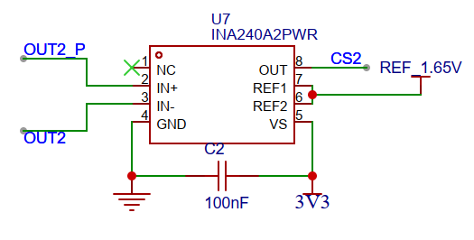

>

你这个图里是 **INA240A2PWR**，不是 INA2040。ADC 只需要采集 **OUT 引脚，也就是 CS2 这个电压**。

核心关系是：

```c
INA240输出电压 = 参考电压 + 增益 * 采样电阻两端电压
```

你的 REF 接了 **1.65V**，所以零电流时：

```c
Vout ≈ 1.65V
```

INA240A2 的增益是：

```c
Gain = 50 V/V
```

所以电流计算公式是：

```c
Vshunt = (Vout - Vzero) / 50
I = Vshunt / Rshunt
```

也就是：

```c
I = (Vout - Vzero) / (50 * Rshunt)
```

其中：

```c
Vout  = ADC采到的CS2电压
Vzero = 零电流时采到的电压，理论是1.65V，实际建议校准
Rshunt = 你的采样电阻阻值，单位Ω
```

比如你的采样电阻是 **0.01Ω，也就是 10mΩ**：

```c
I = (Vout - 1.65) / (50 * 0.01)
I = (Vout - 1.65) / 0.5
```

如果 ADC 采到：

```c
Vout = 1.80V
```

那么：

```c
I = (1.80 - 1.65) / 0.5
I = 0.3A
```

如果：

```c
Vout = 1.50V
```

那么：

```c
I = (1.50 - 1.65) / 0.5
I = -0.3A
```

负数说明电流方向和你 IN+ / IN- 定义的方向相反。

---

建议代码这样写：

```c
#define INA240_GAIN        50.0f       // INA240A2 增益是 50
#define SHUNT_RES_OHM      0.01f       // 采样电阻，比如 10mΩ
#define ADC_REF_MV         3300.0f     // ADC参考电压，ESP32大概3.3V
#define ADC_MAX_RAW        4095.0f     // 12bit ADC最大值

static float ina240_zero_mv = 1650.0f; // 零电流电压，后面建议校准得到

/**
 * @brief 把ADC原始值转换成电流
 */
float ina240_get_current_by_adc_raw(uint32_t adc_raw)
{
    // 1. ADC原始值转成电压，单位mV
    float vout_mv = ((float)adc_raw / ADC_MAX_RAW) * ADC_REF_MV;

    // 2. 输出电压减去零点电压
    float diff_mv = vout_mv - ina240_zero_mv;

    // 3. INA240输出差值 / 增益 = 采样电阻两端电压
    float vshunt_mv = diff_mv / INA240_GAIN;

    // 4. mV转V
    float vshunt_v = vshunt_mv / 1000.0f;

    // 5. I = U / R
    float current_a = vshunt_v / SHUNT_RES_OHM;

    return current_a;
}
```

但是上面这个 ADC 转电压是粗略算法。ESP32 的 ADC 误差比较大，最好用 **ADC校准 API**，也就是先把 raw 转成真实 mV，再计算电流。

---

更推荐你启动时做一次零漂校准，也就是 **MOS 关闭、电机不通电时采一堆 ADC 平均值**：

```c
#define ZERO_CALIB_SAMPLES  1000

float ina240_zero_calibration(void)
{
    uint32_t sum_mv = 0;

    for (int i = 0; i < ZERO_CALIB_SAMPLES; i++)
    {
        int raw = 0;
        int voltage_mv = 0;

        // 这里换成你的 ADC 读取函数
        raw = adc_read_cs2_raw();

        // 粗略换算，实际建议换成 esp_adc_cali_raw_to_voltage()
        voltage_mv = (int)(((float)raw / 4095.0f) * 3300.0f);

        sum_mv += voltage_mv;

        vTaskDelay(pdMS_TO_TICKS(1));
    }

    ina240_zero_mv = (float)sum_mv / ZERO_CALIB_SAMPLES;

    return ina240_zero_mv;
}
```

然后运行时：

```c
float current_a = ina240_get_current_by_adc_raw(adc_raw);
```

---

你这个电路最终完整逻辑是：

```text
电机相线电流
    ↓
采样电阻 Rshunt
    ↓
INA240 IN+ / IN- 检测采样电阻两端压差
    ↓
INA240 OUT 输出 1.65V 附近上下变化的电压
    ↓
ESP32 ADC 采集 CS2
    ↓
Vout - 零点电压
    ↓
除以 INA240增益
    ↓
除以采样电阻
    ↓
得到电流值 A
```

---

你现在最需要确认两个参数：

```c
INA240_GAIN = 50.0f;      // A2版本固定是50
SHUNT_RES_OHM = ?         // 你的采样电阻到底是多少Ω
```

比如：

| 采样电阻 | 最大可测电流大概 |
| ---- | -------: |
| 5mΩ  |    ±6.6A |
| 10mΩ |    ±3.3A |
| 20mΩ |   ±1.65A |

因为你的 REF 是 1.65V，3.3V供电，理论上 OUT 可以上下摆动约 1.65V：

```c
最大采样电阻压差 ≈ 1.65V / 50 = 33mV
```

所以：

```c
Imax ≈ 0.033 / Rshunt
```

如果你的 Rshunt 是 10mΩ：

```c
Imax ≈ 0.033 / 0.01 = 3.3A
```

---

还有一个关键点：你这个是电机相电流，PWM 开关会让电流波形有纹波，所以 ADC 不建议随便在线程里乱采。更好的方式是：

```text
MCPWM 中间点触发 ADC 采样
```

也就是在 PWM 周期比较稳定的位置采样，电流值会更干净。前期调试可以先线程里采样平均，后面做电流环时最好同步 PWM 采样。
