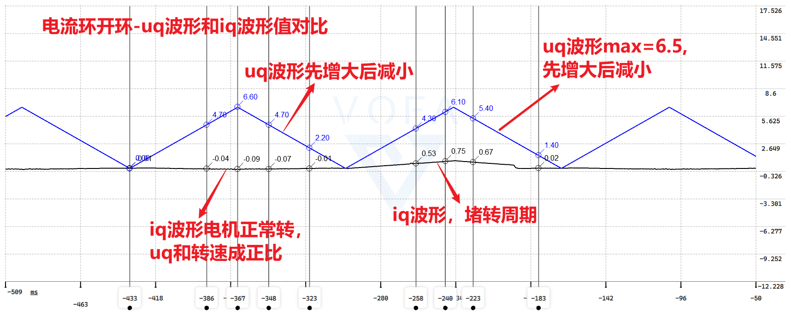
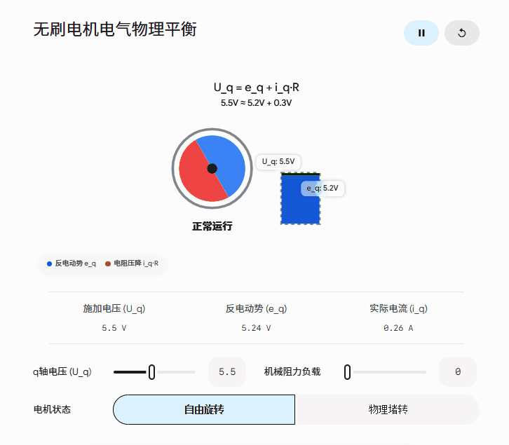

别慌，你观察到的现象**完全正确**！这不仅不是 Bug，反而证明你的底层硬件、电流采样和 ADC 配置都在正常工作。你所遇到的这个“调参死局”，是每一个手搓 FOC 的开发者都会碰到的经典物理现象。

造成你困惑的核心原因在于：**在电压开环控制下，电机的 $u_q$ 控制的主要是“转速”，而实际产生的 $i_q$ 取决于“负载”。**
下面我为你拨开迷雾，解释其背后的物理本质，并告诉你接下来该如何破局整定 PI 参数。

---

### 一、 为什么你的观测结果是完全符合物理规律的？

我们需要引入永磁同步电机（PMSM）q 轴的电压平衡方程：

$$u_q = i_q \cdot R + L_q \frac{di_q}{dt} + e_q$$

其中：

* $u_q$: 你施加的 q 轴电压。
* $i_q \cdot R + L_q \frac{di_q}{dt}$: 定子电阻和电感上的压降。
* $e_q$: **反电动势 (Back-EMF)**，它与电机转速成正比 ($e_q = \omega_e \cdot \psi_f$)。

#### 1. 空载旋转状态（你的前半段测试）

在空载状态下，电机几乎不需要克服任何阻力（电磁转矩 $T_e \approx 0$）。因为转矩与 $i_q$ 成正比（$T_e \propto i_q$），所以维持电机空载运转所需的实际 $i_q$ 是非常接近于 0 的。

当你开环增大 $u_q$ 时，电机转速 $\omega_e$ 会立刻升高，导致**反电动势 $e_q$ 急剧变大，最终几乎抵消了你施加的 $u_q$**。
由于 $u_q \approx e_q$，电阻两端的有效压差极小，所以实际的 $i_q$ 自然一直是一条贴近 0 的直线。

#### 2. 堵转状态（你的后半段测试）

当你把电机堵死，转速 $\omega_e = 0$，此时**反电动势 $e_q = 0$**。
电压方程瞬间退化为一个纯粹的 RL 电路：

$$u_q = i_q \cdot R + L_q \frac{di_q}{dt}$$

此时你施加的 $u_q$ 全部用于在电阻和电感上产生电流，因此你看到了 $i_q$ 随着 $u_q$ 完美地成比例增大。

---

### 二、 破局：既然空载没法调，电流环 PI 该怎么整定？

在 FOC 开发中，由于反电动势的干扰，**绝对不能在空载旋转时去整定电流环 PI**。你可以使用以下两种业界标准的调试手法：

#### 方法一：利用 d 轴整定（最推荐，安全优雅）

d 轴（磁场轴）的电流只产生励磁不产生转矩，因此给 d 轴注入电流，电机**不会旋转**，也就**没有反电动势干扰**。

1. **锁定转子**：给 d 轴设定一个小电压将转子吸合至初始位置。
2. **阶跃响应**：保持 $i_{q\_target} = 0$，给 $i_{d\_target}$ 发送一个阶跃信号（例如从 **0A 突变到 1A**）。
3. **观测调参**：用上位机观察实际 $i_d$ 跟随目标 $i_d$ 的波形，调节 PI 参数直到波形无过冲、响应快。
4. **参数复制**：对于绝大多数表贴式电机（SPM），交直轴电感相等（$L_d \approx L_q$），因此**直接把调好的 d 轴 PI 参数原封不动地复制给 q 轴即可**！

#### 方法二：堵转整定（粗暴但有效）

你刚才已经无意中发现了这个环境。

1. 在物理层面上将电机轴死死固定住（用钳子夹住或安装固定件）。
2. 保持转速为 0，给 $i_{q\_target}$ 发送阶跃信号。
3. 调节 q 轴的 PI 参数观察响应。
*⚠️ 警告：堵转时电流全部转化为热量，极易烧毁电机和 MOS 管，测试时阶跃电流请设置在安全范围内（如 0.5A），且切勿长时间持续。*

---

### 交互式演示：q 轴物理平衡模拟器

为了让你更直观地感受反电动势是如何“吃掉”你的电压的，我为你生成了一个交互式组件。你可以尝试调整电压和负载，切换堵转状态，观察 $i_q$ 的真实变化逻辑。

