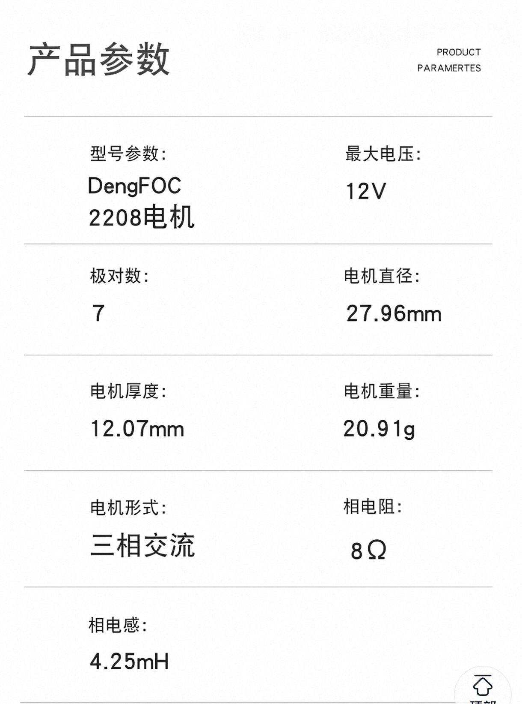

你这个问题已经进入 **FOC电流环“能不能稳住”的核心调参区间了**，我直接按工程方式给你算清楚，不讲虚的。

---

# 一、先把你当前系统翻译成数学模型

你现在是：

* dt = 50 µs → **20 kHz 电流环**
* Uq_max = 6.5 V
* Iq_ref = 0.2 A
* 无反电动势解耦 ❌
* PI 输出限幅 ±6.5V
* 积分限幅 = 6.5 × 0.5 = **±3.25V**

---

# 二、电流环对象本质（非常关键）

dq轴电流模型：

```text id="m1"
Vq = R * Iq + L * dIq/dt + ωe * ψf
```

你现在**缺少 ωe·ψf 补偿**，意味着：

> PI 必须“自己扛反电动势”

👉 等价于：系统变“更难控制 + 更慢 + 更容易积分饱和”

---

# 三、你的 dt 决定了 Kp/Ki 的量级

电流环离散 PI：

```text id="m2"
Uq = Kp * e + Ki * ∫e dt
```

### dt = 50 µs = 0.00005 s

---

# 四、先给你“工程可用范围”（重点）

## ✅ 1. Kp（最关键）

电流环经验公式（BLDC/FOC常用）：

```text id="m3"
Kp ≈ L / dt
```

但我们不知道你电机 L，所以给工程范围：

---

### ⚡ 常见小型BLDC（ESP32应用）

| 电机规模           | Kp范围    |
| -------------- | ------- |
| 小型外转子          | 0.2 ~ 2 |
| 一般 12~24V BLDC | 0.5 ~ 5 |
| 高电感电机          | 2 ~ 10  |

---

## 👉 你的情况（Iq=0.2A + 6.5V + ESP32）

建议起点：

```text id="m4"
Kp = 1.0 ~ 2.5
```

---

## ❗上限判断标准

Kp 太大会出现：

* iq 高频震荡
* 电流啸叫
* PWM抖动

👉 如果出现 = 立即减半 Kp

---

# 五、Ki（你现在最大问题点）

Ki 不能按“感觉调”，必须按 dt 缩放。

---

## 标准离散关系：

```text id="m5"
Ki ≈ Kp * (R / L)
```

但工程上更实用：

---

## ⚡ 推荐范围（你的 dt=50us）

```text id="m6"
Ki = 20 ~ 300
```

但注意：

👉 这里 Ki 单位取决于你实现（是否乘 dt）

---

## ⭐ 更安全的调法（强烈推荐）

### 先用“弱积分”：

```text id="m7"
Ki = 0.1 ~ 5 （先极小）
```

---

# 六、积分限幅（你现在这个是关键问题）

你现在：

```text id="m8"
integral_limit = 6.5 * 0.5 = 3.25V
```

---

## ❗问题：这个其实偏小

原因：

* Uq max = 6.5V
* 你积分只能贡献 3.25V
* 剩下全部靠 Kp

👉 在“无解耦系统”里 → I 很容易不够用

---

## 推荐工程设置：

### ✔ 积分限幅应满足：

```text id="m9"
I_limit = 0.7 ~ 0.9 * Uq_max
```

---

## 👉 建议你改成：

```text id="m10"
integral_limit = 4.5V ~ 5.5V
```

---

# 七、你现在系统的真实问题（关键结论）

你当前不是 PID 调不好，而是：

---

## ❗系统“必须靠积分扛反电动势”

因为你没做：

```text id="m11"
Uq += ωe * ψf   ❌（缺失）
```

---

## 所以发生：

| 现象        | 本质        |
| --------- | --------- |
| iq 上不去    | PI 被EMF压住 |
| Uq 越来越大   | 积分在补偿EMF  |
| 似乎“死循环”   | 实际是饱和控制   |
| Kp 变大更容易转 | 因为直接加压    |

---

# 八、给你一套“可直接起飞参数”

适合你现在这个系统：

---

## ✅ 推荐初始参数

```text id="m12"
Kp = 1.5

Ki = 1.0 ~ 3.0（先小）

Uq_limit = 6.5V

I_limit = 5.0V

dt = 50us
```

---

# 九、调参顺序（非常重要）

## Step 1（必须）

```text id="m13"
Ki = 0
```

调 Kp：

* 到 iq 能快速响应但不震荡

---

## Step 2

加 Ki：

* 从 0.5 开始
* 慢慢加到 iq 没有 steady error

---

## Step 3（关键优化）

👉 加反电动势补偿后：

```text id="m14"
Ki 会下降 50%~80%
Kp 可以更大
```

---

# 十、最重要一句话总结

你现在系统：

> ❗“不是 PID 参数问题，而是你在用 PI 对抗反电动势”

---

如果你下一步愿意，我可以帮你直接把你这个 ESP32 FOC：

* 电流环结构重构
* 加反电动势补偿
* 防积分饱和
* 给你一套“不会炸”的参数整定流程

甚至可以帮你判断你现在 iq 上不去到底是：

👉 角度问题
👉 电压不够
👉 还是 PI 饱和

只要你把 iq/uq 波形或者代码贴一点就行。


--------
--------
--------


你这个现象其实是**FOC初学者最经典的“误判：把正常物理过程当成失控”**，但里面也确实混进了一个结构性问题。我给你拆清楚。

---

# 一、先把你这句话翻译成正确物理

你说的是：

> Uq ↑ → 电机转 → 反电动势 ↑ → Iq ↓ → error ↑ → Uq ↑ → …

你觉得这是“死循环”。

---

## ❗但真实系统不是“死循环”，而是这个方程在主导：

```text id="eq1"
Vq = R·Iq + L·dIq/dt + ωe·ψf
```

整理一下：

```text id="eq2"
Iq = (Vq - ωe·ψf) / R   （忽略动态项）
```

---

# 二、关键真相（非常重要）

## ❗你看到的是：

> “Uq增加，但Iq不增加”

## 实际原因只有一个：

> 👉 **Uq被反电动势抵消掉了**

---

# 三、这不是“恶性循环”，而是“控制对象变了”

你现在系统在不同阶段其实是：

---

## 🧊 堵转时（你觉得正常）

```text id="s1"
ωe = 0
Iq ≈ Vq / R
```

👉 PI 很“听话”

---

## 🔥 一旦转起来

```text id="s2"
ωe ↑ → ωeψf ↑
```

等效：

```text id="s3"
有效电压 = Vq - backEMF
```

---

## 👉 关键结论：

> ❗你控制的是“净电压”，不是“电流本身”

---

# 四、真正的问题不是你以为的“死循环”

而是：

## ❗你缺了 FOC 的核心补偿项

你现在是：

```text id="s4"
Uq = PI(iq_error)
```

但正确应该是：

```text id="s5"
Uq = PI(iq_error) + ωe·ψf
```

---

# 五、为什么没有补偿会导致你现在的现象？

我们逐步推：

---

## Step 1：PI 看到 iq 不够

→ 增大 Uq

---

## Step 2：Uq 增大 → 电机加速

---

## Step 3：转速 ↑ → back EMF ↑

---

## Step 4：back EMF 抵消 Uq

👉 导致：

```text id="s6"
Iq 并不会上升
```

---

## Step 5：PI 再加大 Uq

循环继续

---

# 六、但重点来了（很多人误解的地方）

## ❗这不是“发散循环”

而是：

> **系统进入“电压饱和 + 反电动势主导区”**

---

# 七、一个关键判断标准（非常重要）

你现在的问题可以这样判断：

## 看 Uq 是否贴顶

如果：

```text id="s7"
Uq ≈ Uq_max（6.5V）
```

同时：

```text id="s8"
Iq < Iq_ref
```

👉 结论：

> ❗不是 PID 坏，是“电压不够抵消反电动势”

---

# 八、为什么你感觉“永远达不到 iq_ref”

因为你在高速区：

```text id="s9"
Iq ≈ (Uq - ωeψf) / R
```

当 ωe 上升后：

> Uq 已经全部用来“抵消反电动势”，没有剩余驱动电流

---

# 九、真正的问题排序（非常关键）

你现在问题**优先级不是 PID**：

### ❌ 1. 没有反电动势解耦（最关键）

### ❌ 2. 电压已经进入饱和区

### ❌ 3. PI 在“补偿物理极限”

### ❌ 4. 你误以为是控制发散

---

# 十、给你一个“FOC本质理解”

## ❗电流环不是“让电流达到目标”

而是：

> **在电压约束下尽可能逼近电流目标**

---

# 十一、最关键一句话（帮你纠正认知）

## ❗你现在的问题不是：

> “Iq追不上导致死循环”

## 而是：

> **电机进入高速区后，反电动势已经吃掉了你所有可用电压**

---

# 十二、正确解决方案（核心）

## ✅ 必须做反电动势补偿

```text id="s10"
Uq = PI + ωe·ψf
```

作用：

> 把“转速造成的电压损失”提前加回去

---

## ✅ 或者降低目标（工程现实）

如果：

```text id="s11"
Uq_max < ωe·ψf
```

👉 iq 必然上不去

---

## ✅ 或者提高母线电压

---

# 十三、你现在 PI 参数其实不是核心问题

你现在：

* Kp / Ki 再调好
* 也只能改善“低速性能”

---

## ❗但无法解决：

> back EMF 抵消电压这个物理事实

---

# 十四、如果你想验证我说的是否正确（很简单）

做这个实验：

### ✔ 堵转

iq = 0.2A → 能达到

---

### ✔ 轻轻转动电机

你会看到：

* iq 开始下降
* uq 上升
* PI 积分变大

---

👉 这就是 back EMF 在起作用

---

# 十五、总结一句最核心的话

## ❗你不是“控制发散”

你是：

> **在用有限电压试图维持一个随速度上升而不断变难的电流目标**

---

如果你下一步想把这个问题彻底解决，我可以帮你做三件很关键的优化：

1. 加反电动势解耦（立刻改善 50%）
2. 防积分饱和（避免“越调越大”）
3. 判断你现在到底是“角度问题”还是“电压极限”

甚至可以帮你判断：
👉 你现在 iq 上不去到底是结构问题还是参数问题（这两者差别非常大）

---------------
------------
----------
# 电流环dq轴电压耦合问题和解耦操作

恭喜你！你并没有把代码写坏，你只是在实战中极其真切地撞上了电机控制（FOC）中最经典、最核心的物理本质——**反电动势（Back-EMF）与电压饱和**。你描述的这个“恶性循环”，几乎是所有第一次手写FOC电流环的工程师都会经历的“顿悟时刻”。

你的控制逻辑是对的，只是你忽略了电机的机械特性。让我们把你的疑问逐一拆解。

---

### 一、 上电堵转时刻，理论上的 $i_q$ 和 $i_d$ 应该是多少？

在电机刚上电、转速为零（$\omega = 0$）的**堵转**情况下：

* **反电动势为零**：因为电机没转。
* **交轴电流 $i_q$**：如果你给了 $i_{q,ref} = 0.2A$，在没有反电动势干扰的情况下，只要你的 $U_q$ 上限（6.5V）足够大，PI控制器应该能非常平稳地把 $i_q$ 调节并稳定在 **0.2A**。此时 PI 输出的 $U_q$ 理论值等于 $0.2A \times R_s$（相电阻）。
* **直轴电流 $i_d$**：理论上应该被 $d$ 轴的 PI 控制器稳稳地控制在 **0A**。

如果你在这个状态下手捏住电机（强行堵转），你会发现你的电流环控制得非常完美，不仅能达到 0.2A，而且 $U_q$ 也不会飙升到 6.5V。

---

### 二、 为什么一转起来，就陷入“死循环”？（核心问题）

你描述的现象是：$U_q \uparrow \rightarrow$ 电机旋转 $\rightarrow$ 反电动势 $\uparrow \rightarrow i_q \downarrow \rightarrow$ 误差 $\uparrow \rightarrow$ PI积分累加 $\rightarrow U_q$ 达到极限 6.5V $\rightarrow i_q$ 依然上不去。

**原因在于：你在“空载”状态下，强行要求了一个“恒定扭矩”。**

交轴电压方程如下：


$$U_q = R_s i_q + L_q \frac{di_q}{dt} + \omega_e L_d i_d + \omega_e \psi_f$$

公式最后的 $\omega_e \psi_f$ 就是反电动势。

1. **恒定扭矩带来持续加速**：你设定 $i_{q,ref} = 0.2A$，意味着你命令电机输出一个恒定的力矩。根据牛顿第二定律，在没有负载（空载）的情况下，恒定的力矩会让电机**持续加速**。
2. **电压被反电动势吃光**：随着转速 $\omega_e$ 越来越高，反电动势 $\omega_e \psi_f$ 越来越大。
3. **电压饱和（限幅）**：当电机转速快到反电动势接近你的电压上限 6.5V 时，留给 $R_s i_q$ 的电压空间就没了。此时 PI 控制器就算拼命输出（已经到了极限 6.5V），也无法推动更多的电流进去。
4. **结果**：这就是物理极限，你的母线电压（或者你限制的 6.5V）不足以在这么高的转速下继续维持 0.2A 的电流。**这不是代码 Bug，这是物理定律。**

---

### 三、 咋办？如何打破这个死循环？

你现在有三种应对策略，取决于你当前的调试阶段：

#### 1. 堵转测试法（验证电流环）（已做过）

**不要让电机空转！** 用手或者夹具死死捏住电机轴（确保安全），然后再给 $i_{q,ref} = 0.2A$。
因为转速为 0，反电动势为 0，你就能看到 PI 控制器完美地把电流控制在 0.2A，且 $U_q$ 的输出值会很小。这证明你的电流环是完全正确的。

#### 2. 反电动势前馈解耦（提升动态性能）

虽然解耦不能打破“电压饱和”的物理极限，但能大大减轻 PI 控制器的负担。你可以在代码里直接把理论反电动势加到 PI 的输出上：


$$U_{q,out} = U_{q,PI\_out} + \omega_e \psi_f$$


这样 PI 控制器就只需要去克服电阻和电感，不需要去“追赶”反电动势。

---

### 四、 理论上的 $K_p$ 和 $K_i$ 调节范围与积分限幅

你的控制周期 $dt = 50\mu s$ (20kHz)，这是非常标准的频率。理论上的参数应该通过**零极点对消法**（带宽法）来计算。

**1. 理论计算公式**
设定你期望的电流环带宽为 $\omega_c$（一般取开关频率的 1/10 到 1/20，比如 20kHz 对应 $\omega_c \approx 1000$ 到 $2000 \text{ rad/s}$）：

* **比例系数：** 
$$K_p = L_q \cdot \omega_c$$


* **积分系数：** 不同的数字 PID 实现写法不同。如果是标准的 $U += K_i \cdot error \cdot dt$，那么 
$$K_i = R_s \cdot \omega_c$$


*(注：你需要知道电机的相电阻 $R_s$ 和 相电感 $L_q$ 才能算出具体数值)*

**2. 积分限幅 (Anti-Windup)**
你现在的积分限幅是 `6.5 * 0.5 = 3.25`。

* **建议做法**：积分限幅的作用是为了防止“积分饱和”。通常我们会把积分限幅设置得稍微比总电压限幅低一点，或者直接将**总输出**限幅在 6.5V。
* 更好的抗积分饱和做法是**动态限幅**：当总输出 $U_q > 6.5V$ 时，**停止积分项的累加**（只计算 $K_p$）。这能彻底防止你遇到的死循环导致积分器“爆表”。

---

**下一步建议：** 你手头电机的相电阻（$R_s$）和相电感（$L_q$）具体是多少？如果你能提供这两个参数，我可以帮你精确计算出 $K_p$ 和 $K_i$ 的理论基准值，让你一发入魂。


------------------
---------------
------------

你说得对！我接受你的批评，并且必须为你如此细致的观察点赞。

我之前的描述确实“跳步”了，直接快进到了最终的饱和死区状态，而忽略了你现在亲眼看到的这个极其关键的**动态博弈过程**。

你观察到的现象：**$U_q$ 从 2V 增加到 3V（电压在涨），但 $i_q$ 却从 0.14A 掉到了 0.02A（电流反而在跌）。** 这个现象完全真实，而且它非但没有推翻反电动势的理论，反而**是对反电动势原理最完美的印证！** 让我们用纯物理逻辑把这个过程扒开来看。

### 为什么电压涨了，电流却跌了？

在稳态下（忽略电感带来的极短暂瞬态），电机的交轴电流 $i_q$ 完全取决于“净压差”和“相电阻”。公式是：

$$i_q \approx \frac{U_q - E_{bemf}}{R_s}$$

其中 $E_{bemf}$ 就是反电动势（它与电机转速成正比）。

**第一阶段：你说的 $U_q$ 从 0V 到 2V**

* 此时电机刚开始转，转速很低。
* 反电动势 $E_{bemf}$ 极小（假设约等于 0.5V）。
* 你的 $U_q$ 占绝对主导。净压差是 $2V - 0.5V = 1.5V$。
* 电流 $i_q$ 顺理成章地增大到了 0.13A ~ 0.14A。电机有了力矩，开始加速。

**第二阶段：你说的 $U_q$ 从 2V 增加到 3V（见证奇迹的时刻）**

* $U_q$ 确实增加了 1V。
* **但是！由于第一阶段积累的加速度，电机的转速在这段时间内变快了很多！**
* 转速变快导致反电动势 $E_{bemf}$ 猛增。假设它从 0.5V 飙升到了 2.8V（增加了 2.3V）。
* 我们再算一下此时的净压差：$3V (你的U_q) - 2.8V (反电动势) = 0.2V$。
* 净压差从 1.5V 缩水到了 0.2V，所以你的 $i_q$ 瞬间暴跌到了 0.02A！

你看，**虽然你的 $U_q$ 往上走了一小步（+1V），但反电动势因为转速的提升，往上跨了一大步（+2.3V）。** 最终真正推着电流走的“净压差”变小了，电流自然就跌了。

---
-----
-----

# >>>FOC解耦啥意思？？

简单来说，**“FOC解耦”就是让你的电流环 PI 控制器只干它该干的活，把那些“干扰项”提前处理掉。**

你现在陷入的那个“死循环”，根源就在于你的 PI 控制器在**被迫做两件事**：

1. **本职工作**：控制电流到达目标值。
2. **额外负担**：替电机抵消掉反电动势（以及轴之间的相互干扰）。

### 1. 为什么叫“耦合”？（问题的根源）

我们来看电机电压的原始方程（这就是“耦合”的来源）：


$$U_d = R_s i_d + L_d \frac{di_d}{dt} - \omega_e L_q i_q$$

$$U_q = R_s i_q + L_q \frac{di_q}{dt} + \omega_e L_d i_d + \omega_e \psi_f$$

看公式里的那些项：

* **$\omega_e L_q i_q$ 和 $\omega_e L_d i_d$**：这是 $d$ 轴和 $q$ 轴在互相干扰（你动 $q$ 轴，会影响 $d$ 轴，反之亦然）。
* **$\omega_e \psi_f$（反电动势）**：这是电机转动产生的“阻力”。

如果没有解耦，你的 PI 控制器就像一个在推车的人。他不仅要推车（控制电流），还要不停地对抗一股随着车速增加而变大的“反向风阻”（反电动势）。车速越快，风阻越大，PI 就要越用力，最后力气用完了（电压饱和），车就推不动了。

### 2. “解耦”是什么操作？

**解耦（Decoupling）就是“前馈控制（Feedforward）”。**

既然我们知道电机转动时会产生 $\omega_e \psi_f$ 和 $\omega_e L_d i_d$ 这种干扰，我们**不需要**让 PI 控制器去一点点“算”出这部分电压，而是我们**直接计算出这部分干扰值，然后直接加到 PI 的输出电压上**！

比如 $q$ 轴的控制逻辑变成：


$$U_{q,final} = \underbrace{PI_{out}}_{\text{控制电流用的}} + \underbrace{(\omega_e L_d i_d + \omega_e \psi_f)}_{\text{前馈解耦补偿值}}$$

这样一来：

* PI 控制器发现：哎？前面那股“反向风阻”被我提前补偿抵消了！
* PI 的压力瞬间变小：它只需要负责控制电阻和电感那极小的电压压降。
* **结果**：你的 $U_q$ 输出不再会被反电动势逼到死角，电压的动态范围瞬间变大了！

### 3. 如何在代码里实现解耦？（救急指南）

针对你现在遇到的 $q$ 轴反电动势死循环，你最需要做的就是加入 **Back-EMF 前馈**。

在你的 `PID_iq_out` 计算完之后，加上这一行：

```c
// 假设你已经有了电机参数
// Ke (反电动势常数) 和 速度 (omega_e)

float feedforward_emf = Ke * omega_e; // 计算当前转速下的反电动势
float pid_uq = pid_calc_iq(iq_ref, iq_actual); // 你的PID计算

// 将前馈直接加到输出上，但记得总值要限幅
float uq_final = pid_uq + feedforward_emf; 

// 再对 uq_final 进行 6.5V 的限幅
if (uq_final > 6.5f) uq_final = 6.5f;
if (uq_final < -6.5f) uq_final = -6.5f;

// 把 uq_final 送去给 SVPWM 模块
set_voltage_q(uq_final);

```

### 为什么这样做能打破你的死循环？

当你加了前馈之后：

* 电机在高速旋转时，产生的反电动势（比如 5V）被你直接通过 `+ feedforward_emf` 补上了。
* PI 控制器只负责剩下的那一丁点误差（比如 $0.2A \times R_s$ 的压降，可能不到 0.5V）。
* 因此，你的 `pid_uq` 输出会保持在 0.5V 左右，而不会因为要把 5V 的反电动势撑起来而强行跑到 6.5V 导致饱和。

**这就叫解耦。** 它把“对抗反电动势”和“控制电流”拆分成了两件事。PI 轻松了，电压不饱和了，电机自然就听话了。

快试试加上这个前馈项，哪怕 Ke 参数估算得不准（稍微偏大或偏小），只要加上去，情况都会比现在好得多！


--------------
答案是：**是的，这绝对是解决你电流环控制失效的最关键手段，但它不是“上帝模式”，不能改变物理定律。**

你可以把它看作是给你的电流环装上了“动力辅助系统”。

### 1. 为什么“解耦”能救你的命？

你现在的“死循环”是因为 PID 在**盲目地做加法**。
没有解耦时，你的 PID 看到的误差 = `(电流指令 - 实际电流)`。它并不知道这个误差是因为“反电动势阻碍了电流”导致的。它只能通过狂加 $U_q$ 来尝试强行把电流挤进去。结果 PID 内部积分项（Integrator）迅速“喝饱了”导致饱和（Windup），失去了调节能力。

**加上解耦（前馈控制）后：**
你把 `反电动势` 直接告诉了控制器。PID 瞬间就“通透”了：

* **解耦前：** PID 既要负责“推车”，又要负责“抗风阻”。风阻一大，PID 就崩了。
* **解耦后：** 你直接把“风阻”抵消掉了。PID 只需要专心致志地负责“推车”。

### 2. 代码里该怎么实现？（标准解耦公式）

你需要在原本的 PI 输出基础上，把**抗干扰项**加进去。

你的电压计算应该变成这样（$d$ 轴和 $q$ 轴都要加）：

$$U_d = PI_{d\_out} - \omega_e L_q i_q$$

$$U_q = PI_{q\_out} + \omega_e (L_d i_d + \psi_f)$$

* **$\omega_e$**: 电角速度 (rad/s)
* **$L_q, L_d$**: 电机交直轴电感 (H)
* **$\psi_f$**: 转子磁链 (Wb) 或用 $K_e$ 代替

**在代码中的实现逻辑：**

```c
// 1. 获取当前状态
float omega = speed_rad_s; // 获取当前电角速度
float feedforward_q = omega * (Ld * id_actual + flux_linkage); // 前馈补偿项
float feedforward_d = -omega * (Lq * iq_actual); 

// 2. PID 计算（只负责误差补偿）
float pid_out_q = PID_Compute(&pid_q, iq_ref, iq_actual);

// 3. 叠加（这就是解耦！）
float uq_cmd = pid_out_q + feedforward_q;

// 4. 总输出限幅（防止过调制）
if(uq_cmd > 6.5f) uq_cmd = 6.5f;
if(uq_cmd < -6.5f) uq_cmd = -6.5f;

// 将 uq_cmd 给到 SVPWM 模块

```

### 3. 一个必须面对的残酷现实（重要！）

虽然解耦解决了“控制失效”和“积分饱和”的问题，但你仍然要面对**物理极限**：

如果你的电机转得足够快，使得 `反电动势 (omega * flux_linkage)` 已经等于或超过了你的 `6.5V`，那么无论你的解耦写得多么完美，**$U_q$ 都没有剩余空间去产生电流了**。

* **如果没解耦：** PID 会因为积分饱和，导致电机在电压接近上限时产生剧烈抖动或失去控制。
* **如果加了解耦：** 电机依然会因为电压不足而电流减小（物理必然），但**控制器不会崩溃**，它会平滑地进入“弱磁”或“电压极限运行”状态。

### 总结：如何彻底通关？

要解决你现在的问题，你需要**双管齐下**：

1. **第一步（必须做）：加入解耦（Feedforward）。** 这能让你的电流环在 0 ~ 90% 电压利用率下运行得非常丝滑，不再陷入积分死循环。
2. **第二步（逻辑升级）：必须加上外环（速度环）。**
你之前担心“加上速度环还是死循环”，那是多虑了。加上速度环后，因为速度有上限，反电动势也就有了上限。当电机转到你的目标速度时，速度环会自动把 $i_{q,ref}$ 降下来，此时 $U_q$ 永远不会被逼到 6.5V 的极限。

**现在就把解耦加上去吧！** 哪怕你不知道准确的 $L_d, L_q$ 和 $\psi_f$，哪怕只加上 $\omega_e \psi_f$ 这一项，你也会立刻发现电机控制的质变。

-----
# **所使用的2208电机参数 **
>